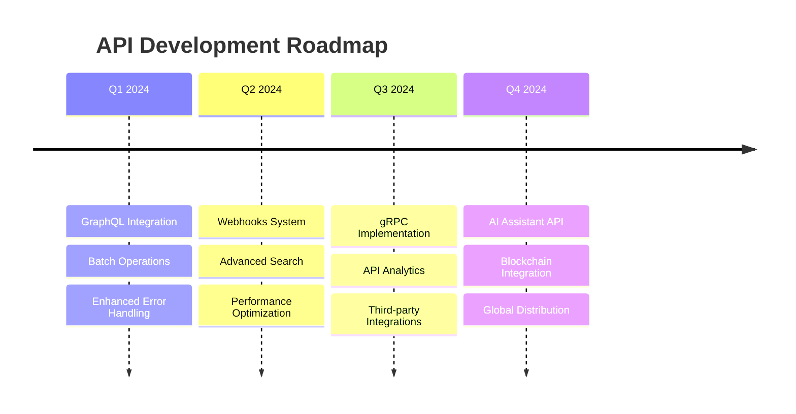

# 📡 API Reference

<div align="center">


**Comprehensive REST & WebSocket API Documentation**

</div>

---

## 🎯 API Overview

Mappa Collaborative IDE provides a comprehensive RESTful API and real-time WebSocket interface for seamless integration and collaboration. Our API is designed with developer experience in mind, featuring consistent patterns, comprehensive error handling, and extensive documentation.

## 🏗️ API Architecture

```
┌═══════════════════════════════════════════════════════════════════════════════════════┐
║                              📱 CLIENT APPLICATIONS LAYER                            ║
╠═══════════════════════════════════════════════════════════════════════════════════════╣
║                                                                                       ║
║  🌐 Web App              📱 Mobile App           🖥️ Desktop App        🔌 Third-party  ║
║     ├─ React/Next.js        ├─ React Native         ├─ Electron           ├─ REST API  ║
║     ├─ Real-time UI         ├─ Offline Support      ├─ Native Features    ├─ Webhooks  ║
║     ├─ Code Editor          ├─ Push Notifications   ├─ File System        ├─ SDK       ║
║     └─ Collaboration        └─ Sync on Connect      └─ System Integration └─ OAuth     ║
║                                                                                       ║
╚═══════════════════════════════════════════════════════════════════════════════════════╝
                                           │
                                           ▼
┌═══════════════════════════════════════════════════════════════════════════════════════┐
║                              🚪 API GATEWAY LAYER                                    ║
╠═══════════════════════════════════════════════════════════════════════════════════════╣
║                                                                                       ║
║  🛡️ API Gateway                         🔐 Authentication Service                     ║
║     ├─ Request Routing                     ├─ JWT Token Validation                    ║
║     ├─ Load Balancing                      ├─ User Session Management                 ║
║     ├─ SSL Termination                     ├─ Role-Based Access Control              ║
║     └─ Health Monitoring                   └─ OAuth Integration                       ║
║                                                                                       ║
║  ⚡ Rate Limiting                        ✅ Request Validation                         ║
║     ├─ Per-User Limits                     ├─ Schema Validation                       ║
║     ├─ API Endpoint Limits                 ├─ Input Sanitization                     ║
║     ├─ IP-Based Throttling                 ├─ Type Checking                          ║
║     └─ Adaptive Rate Control               └─ Error Handling                         ║
║                                                                                       ║
╚═══════════════════════════════════════════════════════════════════════════════════════╝
                                           │
                                           ▼
┌═══════════════════════════════════════════════════════════════════════════════════════┐
║                               🎯 REST API ENDPOINTS                                   ║
╠═══════════════════════════════════════════════════════════════════════════════════════╣
║                                                                                       ║
║  🔐 Auth API              👥 User API             📁 Repository API                   ║
║     ├─ /auth/login          ├─ /users/profile       ├─ /repos/create                  ║
║     ├─ /auth/register       ├─ /users/settings      ├─ /repos/{id}/branches           ║
║     ├─ /auth/refresh        ├─ /users/preferences   ├─ /repos/{id}/commits            ║
║     └─ /auth/logout         └─ /users/activity      └─ /repos/{id}/collaborators      ║
║                                                                                       ║
║  📄 File API              🤝 Collaboration API      🎥 Meeting API                    ║
║     ├─ /files/upload        ├─ /collab/rooms         ├─ /meetings/create              ║
║     ├─ /files/download       ├─ /collab/presence     ├─ /meetings/{id}/join           ║
║     ├─ /files/operations     ├─ /collab/sync         ├─ /meetings/{id}/record         ║
║     └─ /files/versions       └─ /collab/conflicts    └─ /meetings/{id}/participants   ║
║                                                                                       ║
║                                       🔍 Search API                                   ║
║                                          ├─ /search/code                             ║
║                                          ├─ /search/files                            ║
║                                          ├─ /search/repos                            ║
║                                          └─ /search/users                            ║
║                                                                                       ║
╚═══════════════════════════════════════════════════════════════════════════════════════╝
                                           │
                                           ▼
┌═══════════════════════════════════════════════════════════════════════════════════════┐
║                              📡 REAL-TIME SERVICES                                   ║
╠═══════════════════════════════════════════════════════════════════════════════════════╣
║                                                                                       ║
║  🔌 WebSocket Server                    🎯 Liveblocks Integration                     ║
║     ├─ Connection Management               ├─ Room Management                         ║
║     ├─ Event Broadcasting                  ├─ Conflict-Free Replicated Data Types    ║
║     ├─ Channel Subscriptions               ├─ Operation Transformation               ║
║     └─ Heartbeat Monitoring                └─ History & Undo/Redo                    ║
║                                                                                       ║
║  👁️ Presence System                      📬 Notifications Service                    ║
║     ├─ User Status Tracking                ├─ Real-time Alerts                       ║
║     ├─ Cursor Positions                    ├─ Email Notifications                    ║
║     ├─ Selection Ranges                    ├─ Push Notifications                     ║
║     └─ Activity Indicators                 └─ Webhook Delivery                       ║
║                                                                                       ║
╚═══════════════════════════════════════════════════════════════════════════════════════╝
                                           │
                                           ▼
┌═══════════════════════════════════════════════════════════════════════════════════════┐
║                                💾 DATA LAYER                                         ║
╠═══════════════════════════════════════════════════════════════════════════════════════╣
║                                                                                       ║
║  🐘 PostgreSQL                          ⚡ Redis Cache                                ║
║     ├─ User Management                     ├─ Session Storage                         ║
║     ├─ Repository Metadata                 ├─ API Response Caching                   ║
║     ├─ Collaboration History               ├─ Real-time State                        ║
║     └─ Analytics Data                      └─ Pub/Sub Messaging                      ║
║                                                                                       ║
║  📁 File Storage                        🔍 Elasticsearch                              ║
║     ├─ S3-Compatible Storage               ├─ Full-text Search                       ║
║     ├─ Version Control                     ├─ Code Indexing                          ║
║     ├─ Backup & Recovery                   ├─ Auto-complete Data                     ║
║     └─ CDN Distribution                    └─ Analytics Aggregation                  ║
║                                                                                       ║
╚═══════════════════════════════════════════════════════════════════════════════════════╝

🔄 API Communication Flow:
Client Request → API Gateway → Authentication → Rate Limiting → Validation → Route Handler → Data Layer → Response

📊 Performance Metrics:
├─ Request Throughput: 10,000 req/sec
├─ Average Response Time: < 100ms
├─ WebSocket Connections: 50,000 concurrent
└─ API Uptime: 99.9% SLA
```

## 🔐 Authentication

### 🎫 JWT Token Authentication

All API requests require authentication using JWT tokens in the Authorization header.

```http
Authorization: Bearer <your_jwt_token>
```

### 📝 Authentication Endpoints

#### POST /auth/register
Register a new user account.

**Request Body:**
```json
{
  "email": "user@example.com",
  "username": "johndoe",
  "password": "SecurePassword123!",
  "full_name": "John Doe"
}
```

**Response:**
```json
{
  "success": true,
  "data": {
    "user": {
      "id": "123e4567-e89b-12d3-a456-426614174000",
      "email": "user@example.com",
      "username": "johndoe",
      "full_name": "John Doe",
      "created_at": "2024-01-15T10:30:00Z"
    },
    "token": "eyJhbGciOiJIUzI1NiIsInR5cCI6IkpXVCJ9...",
    "refresh_token": "def50200e8b5f...",
    "expires_in": 900
  }
}
```

#### POST /auth/login
Authenticate user credentials.

**Request Body:**
```json
{
  "email": "user@example.com",
  "password": "SecurePassword123!"
}
```

**Response:**
```json
{
  "success": true,
  "data": {
    "user": {
      "id": "123e4567-e89b-12d3-a456-426614174000",
      "email": "user@example.com",
      "username": "johndoe",
      "full_name": "John Doe",
      "last_login": "2024-01-15T10:30:00Z"
    },
    "token": "eyJhbGciOiJIUzI1NiIsInR5cCI6IkpXVCJ9...",
    "refresh_token": "def50200e8b5f...",
    "expires_in": 900
  }
}
```

#### POST /auth/refresh
Refresh expired access token.

**Request Body:**
```json
{
  "refresh_token": "def50200e8b5f..."
}
```

**Response:**
```json
{
  "success": true,
  "data": {
    "token": "eyJhbGciOiJIUzI1NiIsInR5cCI6IkpXVCJ9...",
    "refresh_token": "abc12300e8b5f...",
    "expires_in": 900
  }
}
```

## 👥 User Management API

### GET /users/profile
Get current user profile.

**Headers:**
```http
Authorization: Bearer <token>
```

**Response:**
```json
{
  "success": true,
  "data": {
    "id": "123e4567-e89b-12d3-a456-426614174000",
    "email": "user@example.com",
    "username": "johndoe",
    "full_name": "John Doe",
    "avatar_url": "https://cdn.mappa-ide.com/avatars/123e4567.jpg",
    "created_at": "2024-01-15T10:30:00Z",
    "last_login": "2024-01-20T15:45:00Z",
    "subscription": {
      "tier": "pro",
      "expires_at": "2024-12-31T23:59:59Z"
    },
    "preferences": {
      "theme": "dark",
      "editor_font_size": 14,
      "notifications_enabled": true
    }
  }
}
```

### PUT /users/profile
Update user profile.

**Request Body:**
```json
{
  "full_name": "John Smith",
  "avatar_url": "https://cdn.mappa-ide.com/avatars/new-avatar.jpg",
  "preferences": {
    "theme": "light",
    "editor_font_size": 16,
    "notifications_enabled": false
  }
}
```

**Response:**
```json
{
  "success": true,
  "message": "Profile updated successfully",
  "data": {
    "id": "123e4567-e89b-12d3-a456-426614174000",
    "full_name": "John Smith",
    "avatar_url": "https://cdn.mappa-ide.com/avatars/new-avatar.jpg",
    "updated_at": "2024-01-20T16:00:00Z"
  }
}
```

## 📁 Repository Management API

### GET /repo/list
Get user repositories with pagination.

**Query Parameters:**
- `page` (optional): Page number (default: 1)
- `limit` (optional): Items per page (default: 20, max: 100)
- `search` (optional): Search query for repository name/description
- `sort` (optional): Sort by `name`, `created_at`, `updated_at` (default: `updated_at`)
- `order` (optional): `asc` or `desc` (default: `desc`)

**Example Request:**
```http
GET /repo/list?page=1&limit=10&search=web&sort=name&order=asc
Authorization: Bearer <token>
```

**Response:**
```json
{
  "success": true,
  "data": {
    "repositories": [
      {
        "id": "repo-123e4567-e89b-12d3-a456-426614174000",
        "name": "my-web-app",
        "description": "A modern web application",
        "owner": {
          "id": "123e4567-e89b-12d3-a456-426614174000",
          "username": "johndoe",
          "full_name": "John Doe"
        },
        "is_public": false,
        "collaborators_count": 3,
        "files_count": 47,
        "size_bytes": 2048576,
        "language": "TypeScript",
        "created_at": "2024-01-15T10:30:00Z",
        "updated_at": "2024-01-20T14:22:00Z",
        "last_activity": "2024-01-20T14:22:00Z",
        "role": "owner"
      }
    ],
    "pagination": {
      "page": 1,
      "limit": 10,
      "total": 23,
      "pages": 3,
      "has_next": true,
      "has_prev": false
    }
  }
}
```

### POST /repo/create
Create a new repository.

**Request Body:**
```json
{
  "name": "new-project",
  "description": "A new exciting project",
  "is_public": false,
  "template": "react-typescript",
  "organization_id": null
}
```

**Response:**
```json
{
  "success": true,
  "message": "Repository created successfully",
  "data": {
    "id": "repo-456e7890-e89b-12d3-a456-426614174000",
    "name": "new-project",
    "description": "A new exciting project",
    "owner": {
      "id": "123e4567-e89b-12d3-a456-426614174000",
      "username": "johndoe"
    },
    "is_public": false,
    "created_at": "2024-01-20T16:30:00Z",
    "clone_url": "https://api.mappa-ide.com/repo/456e7890-e89b-12d3-a456-426614174000.git"
  }
}
```

### GET /repo/{repo_id}
Get repository details.

**Path Parameters:**
- `repo_id`: Repository ID

**Response:**
```json
{
  "success": true,
  "data": {
    "id": "repo-123e4567-e89b-12d3-a456-426614174000",
    "name": "my-web-app",
    "description": "A modern web application",
    "owner": {
      "id": "123e4567-e89b-12d3-a456-426614174000",
      "username": "johndoe",
      "full_name": "John Doe",
      "avatar_url": "https://cdn.mappa-ide.com/avatars/123e4567.jpg"
    },
    "is_public": false,
    "language": "TypeScript",
    "topics": ["web", "react", "typescript"],
    "collaborators": [
      {
        "user": {
          "id": "234e5678-e89b-12d3-a456-426614174001",
          "username": "janedoe",
          "full_name": "Jane Doe"
        },
        "role": "maintainer",
        "joined_at": "2024-01-16T08:15:00Z"
      }
    ],
    "statistics": {
      "files_count": 47,
      "size_bytes": 2048576,
      "commits_count": 128,
      "branches_count": 3,
      "contributors_count": 4
    },
    "created_at": "2024-01-15T10:30:00Z",
    "updated_at": "2024-01-20T14:22:00Z"
  }
}
```

### PUT /repo/{repo_id}
Update repository settings.

**Request Body:**
```json
{
  "name": "updated-project-name",
  "description": "Updated project description",
  "is_public": true,
  "topics": ["web", "react", "typescript", "nextjs"]
}
```

### DELETE /repo/{repo_id}
Delete repository (owner only).

**Response:**
```json
{
  "success": true,
  "message": "Repository deleted successfully"
}
```

## 📄 File Operations API

### GET /file/tree/{repo_id}
Get repository file tree.

**Query Parameters:**
- `path` (optional): Specific directory path (default: root)
- `recursive` (optional): Include subdirectories (default: false)

**Response:**
```json
{
  "success": true,
  "data": {
    "path": "/",
    "type": "directory",
    "children": [
      {
        "name": "src",
        "path": "/src",
        "type": "directory",
        "size": null,
        "children": [
          {
            "name": "index.ts",
            "path": "/src/index.ts",
            "type": "file",
            "size": 1024,
            "language": "typescript",
            "last_modified": "2024-01-20T14:22:00Z",
            "last_modified_by": {
              "id": "123e4567-e89b-12d3-a456-426614174000",
              "username": "johndoe"
            }
          }
        ]
      },
      {
        "name": "package.json",
        "path": "/package.json",
        "type": "file",
        "size": 2048,
        "language": "json",
        "last_modified": "2024-01-19T09:15:00Z"
      }
    ]
  }
}
```

### GET /file/content/{repo_id}
Get file content.

**Query Parameters:**
- `path`: File path (required)
- `version` (optional): Specific version/commit hash

**Response:**
```json
{
  "success": true,
  "data": {
    "path": "/src/index.ts",
    "content": "import React from 'react';\nimport ReactDOM from 'react-dom';\n\nconst App = () => {\n  return <h1>Hello World!</h1>;\n};\n\nReactDOM.render(<App />, document.getElementById('root'));",
    "language": "typescript",
    "size": 156,
    "hash": "a1b2c3d4e5f6...",
    "last_modified": "2024-01-20T14:22:00Z",
    "last_modified_by": {
      "id": "123e4567-e89b-12d3-a456-426614174000",
      "username": "johndoe",
      "full_name": "John Doe"
    }
  }
}
```

### PUT /file/content/{repo_id}
Update file content.

**Request Body:**
```json
{
  "path": "/src/index.ts",
  "content": "import React from 'react';\nimport ReactDOM from 'react-dom';\n\nconst App = () => {\n  return <h1>Hello Mappa!</h1>;\n};\n\nReactDOM.render(<App />, document.getElementById('root'));",
  "commit_message": "Update welcome message",
  "encoding": "utf-8"
}
```

**Response:**
```json
{
  "success": true,
  "message": "File updated successfully",
  "data": {
    "path": "/src/index.ts",
    "hash": "b2c3d4e5f6a7...",
    "size": 160,
    "commit": {
      "id": "commit-789a0123-e89b-12d3-a456-426614174000",
      "message": "Update welcome message",
      "author": {
        "id": "123e4567-e89b-12d3-a456-426614174000",
        "username": "johndoe"
      },
      "timestamp": "2024-01-20T16:45:00Z"
    }
  }
}
```

### POST /file/create/{repo_id}
Create new file or directory.

**Request Body:**
```json
{
  "path": "/src/components/Button.tsx",
  "type": "file",
  "content": "import React from 'react';\n\ninterface ButtonProps {\n  children: React.ReactNode;\n  onClick?: () => void;\n}\n\nconst Button: React.FC<ButtonProps> = ({ children, onClick }) => {\n  return <button onClick={onClick}>{children}</button>;\n};\n\nexport default Button;",
  "commit_message": "Add Button component"
}
```

### DELETE /file/{repo_id}
Delete file or directory.

**Request Body:**
```json
{
  "path": "/src/components/OldComponent.tsx",
  "commit_message": "Remove unused component"
}
```

### POST /file/upload/{repo_id}
Upload multiple files.

**Content-Type:** `multipart/form-data`

**Form Data:**
- `files`: File uploads
- `path`: Target directory path
- `commit_message`: Commit message

**Response:**
```json
{
  "success": true,
  "message": "Files uploaded successfully",
  "data": {
    "uploaded_files": [
      {
        "name": "image.png",
        "path": "/assets/image.png",
        "size": 51200,
        "type": "image/png"
      }
    ],
    "commit": {
      "id": "commit-890b1234-e89b-12d3-a456-426614174000",
      "message": "Upload assets",
      "files_count": 1
    }
  }
}
```

## 🤝 Collaboration API

### GET /collab/room/{repo_id}
Join collaboration room.

**Response:**
```json
{
  "success": true,
  "data": {
    "room_id": "room-123e4567-e89b-12d3-a456-426614174000",
    "repository": {
      "id": "repo-123e4567-e89b-12d3-a456-426614174000",
      "name": "my-web-app"
    },
    "participants": [
      {
        "user": {
          "id": "123e4567-e89b-12d3-a456-426614174000",
          "username": "johndoe",
          "full_name": "John Doe",
          "avatar_url": "https://cdn.mappa-ide.com/avatars/123e4567.jpg"
        },
        "status": "active",
        "joined_at": "2024-01-20T16:00:00Z",
        "cursor_position": {
          "file": "/src/index.ts",
          "line": 5,
          "column": 12
        }
      }
    ],
    "websocket_url": "wss://api.mappa-ide.com/collab/ws/room-123e4567-e89b-12d3-a456-426614174000"
  }
}
```

### GET /collab/presence/{repo_id}
Get real-time presence information.

**Response:**
```json
{
  "success": true,
  "data": {
    "active_users": [
      {
        "user": {
          "id": "123e4567-e89b-12d3-a456-426614174000",
          "username": "johndoe",
          "full_name": "John Doe"
        },
        "status": "editing",
        "current_file": "/src/index.ts",
        "cursor_position": {
          "line": 5,
          "column": 12
        },
        "selection": {
          "start": { "line": 5, "column": 12 },
          "end": { "line": 5, "column": 25 }
        },
        "last_activity": "2024-01-20T16:45:00Z"
      }
    ],
    "total_active": 1
  }
}
```

## 📊 Version Control API

### GET /version/history/{repo_id}
Get version history.

**Query Parameters:**
- `page` (optional): Page number (default: 1)
- `limit` (optional): Items per page (default: 20)
- `file_path` (optional): Filter by specific file

**Response:**
```json
{
  "success": true,
  "data": {
    "versions": [
      {
        "id": "version-123e4567-e89b-12d3-a456-426614174000",
        "version_number": 15,
        "commit_message": "Add new feature",
        "author": {
          "id": "123e4567-e89b-12d3-a456-426614174000",
          "username": "johndoe",
          "full_name": "John Doe"
        },
        "created_at": "2024-01-20T16:45:00Z",
        "files_changed": [
          {
            "path": "/src/index.ts",
            "change_type": "modified",
            "additions": 5,
            "deletions": 2
          }
        ],
        "total_changes": {
          "files": 1,
          "additions": 5,
          "deletions": 2
        }
      }
    ],
    "pagination": {
      "page": 1,
      "limit": 20,
      "total": 15,
      "pages": 1
    }
  }
}
```

### POST /version/create/{repo_id}
Create new version/commit.

**Request Body:**
```json
{
  "commit_message": "Implement user authentication",
  "files": [
    {
      "path": "/src/auth.ts",
      "content": "// Authentication logic here",
      "change_type": "added"
    },
    {
      "path": "/src/index.ts",
      "content": "// Updated main file",
      "change_type": "modified"
    }
  ],
  "branch": "main"
}
```

### GET /version/diff/{repo_id}
Compare versions.

**Query Parameters:**
- `from_version`: Source version ID
- `to_version`: Target version ID
- `file_path` (optional): Specific file to compare

## 📞 Meeting API

### GET /meeting/list
Get scheduled meetings.

**Query Parameters:**
- `repo_id` (optional): Filter by repository
- `status` (optional): `upcoming`, `active`, `completed`
- `date_from` (optional): Start date filter
- `date_to` (optional): End date filter

**Response:**
```json
{
  "success": true,
  "data": {
    "meetings": [
      {
        "id": "meeting-123e4567-e89b-12d3-a456-426614174000",
        "title": "Sprint Planning",
        "description": "Plan the next sprint goals",
        "repository": {
          "id": "repo-123e4567-e89b-12d3-a456-426614174000",
          "name": "my-web-app"
        },
        "organizer": {
          "id": "123e4567-e89b-12d3-a456-426614174000",
          "username": "johndoe",
          "full_name": "John Doe"
        },
        "participants": [
          {
            "user": {
              "id": "234e5678-e89b-12d3-a456-426614174001",
              "username": "janedoe",
              "full_name": "Jane Doe"
            },
            "status": "accepted"
          }
        ],
        "scheduled_at": "2024-01-21T14:00:00Z",
        "duration_minutes": 60,
        "status": "upcoming",
        "meeting_url": "https://meet.mappa-ide.com/meeting-123e4567",
        "created_at": "2024-01-20T10:00:00Z"
      }
    ]
  }
}
```

### POST /meeting/create
Schedule a new meeting.

**Request Body:**
```json
{
  "title": "Code Review Session",
  "description": "Review recent pull requests",
  "repo_id": "repo-123e4567-e89b-12d3-a456-426614174000",
  "scheduled_at": "2024-01-22T15:00:00Z",
  "duration_minutes": 45,
  "participants": [
    "234e5678-e89b-12d3-a456-426614174001",
    "345e6789-e89b-12d3-a456-426614174002"
  ],
  "settings": {
    "auto_record": true,
    "allow_screen_share": true,
    "waiting_room": false
  }
}
```

### GET /meeting/{meeting_id}/join
Join a meeting.

**Response:**
```json
{
  "success": true,
  "data": {
    "meeting": {
      "id": "meeting-123e4567-e89b-12d3-a456-426614174000",
      "title": "Code Review Session",
      "status": "active"
    },
    "join_url": "https://meet.mappa-ide.com/join/abc123def456",
    "token": "eyJhbGciOiJIUzI1NiIsInR5cCI6IkpXVCJ9...",
    "permissions": {
      "can_share_screen": true,
      "can_record": false,
      "is_moderator": true
    }
  }
}
```

## 🔍 Search API

### GET /search
Global search across repositories, files, and content.

**Query Parameters:**
- `q`: Search query (required)
- `type` (optional): `repositories`, `files`, `content`, `users` (default: all)
- `repo_id` (optional): Limit search to specific repository
- `language` (optional): Filter by programming language
- `page` (optional): Page number (default: 1)
- `limit` (optional): Items per page (default: 20)

**Response:**
```json
{
  "success": true,
  "data": {
    "query": "authentication",
    "results": {
      "repositories": [
        {
          "id": "repo-123e4567-e89b-12d3-a456-426614174000",
          "name": "auth-service",
          "description": "User authentication microservice",
          "owner": {
            "username": "johndoe"
          },
          "language": "TypeScript",
          "score": 0.95
        }
      ],
      "files": [
        {
          "repository_id": "repo-123e4567-e89b-12d3-a456-426614174000",
          "path": "/src/auth/index.ts",
          "name": "index.ts",
          "language": "typescript",
          "score": 0.89,
          "matches": [
            {
              "line": 15,
              "content": "export class AuthenticationService {",
              "highlight": "export class <mark>Authentication</mark>Service {"
            }
          ]
        }
      ],
      "content": [
        {
          "repository_id": "repo-123e4567-e89b-12d3-a456-426614174000",
          "file_path": "/docs/authentication.md",
          "context": "User authentication flow documentation",
          "score": 0.87,
          "matches": [
            {
              "line": 23,
              "content": "The authentication process involves JWT tokens",
              "highlight": "The <mark>authentication</mark> process involves JWT tokens"
            }
          ]
        }
      ]
    },
    "total_results": {
      "repositories": 1,
      "files": 5,
      "content": 12
    },
    "pagination": {
      "page": 1,
      "limit": 20,
      "total": 18,
      "pages": 1
    }
  }
}
```

## 🔌 WebSocket API

### Connection
Connect to the WebSocket server for real-time collaboration.

**URL:** `wss://api.mappa-ide.com/ws/{room_id}`

**Headers:**
```
Authorization: Bearer <token>
```

### Message Types

#### 1. Join Room
```json
{
  "type": "join_room",
  "data": {
    "room_id": "room-123e4567-e89b-12d3-a456-426614174000",
    "user": {
      "id": "123e4567-e89b-12d3-a456-426614174000",
      "username": "johndoe"
    }
  }
}
```

#### 2. Cursor Movement
```json
{
  "type": "cursor_move",
  "data": {
    "file_path": "/src/index.ts",
    "position": {
      "line": 10,
      "column": 5
    },
    "selection": {
      "start": { "line": 10, "column": 5 },
      "end": { "line": 10, "column": 15 }
    }
  }
}
```

#### 3. Text Change
```json
{
  "type": "text_change",
  "data": {
    "file_path": "/src/index.ts",
    "changes": [
      {
        "type": "insert",
        "position": { "line": 10, "column": 5 },
        "text": "console.log('Hello');"
      }
    ],
    "version": 15
  }
}
```

#### 4. File Operation
```json
{
  "type": "file_operation",
  "data": {
    "operation": "create",
    "path": "/src/components/NewComponent.tsx",
    "content": "import React from 'react';\n\nconst NewComponent = () => {\n  return <div>New Component</div>;\n};\n\nexport default NewComponent;"
  }
}
```

#### 5. Presence Update
```json
{
  "type": "presence_update",
  "data": {
    "user": {
      "id": "123e4567-e89b-12d3-a456-426614174000",
      "username": "johndoe",
      "full_name": "John Doe",
      "avatar_url": "https://cdn.mappa-ide.com/avatars/123e4567.jpg"
    },
    "status": "editing",
    "current_file": "/src/index.ts",
    "cursor_position": {
      "line": 10,
      "column": 5
    }
  }
}
```

## ❌ Error Handling

### Standard Error Response Format

```json
{
  "success": false,
  "error": {
    "code": "VALIDATION_ERROR",
    "message": "Invalid input data",
    "details": {
      "field": "email",
      "reason": "Invalid email format"
    },
    "timestamp": "2024-01-20T16:45:00Z",
    "request_id": "req-789a0123-e89b-12d3-a456-426614174000"
  }
}
```

### Common Error Codes

| Code | HTTP Status | Description |
|------|-------------|-------------|
| `INVALID_CREDENTIALS` | 401 | Invalid login credentials |
| `TOKEN_EXPIRED` | 401 | JWT token has expired |
| `INSUFFICIENT_PERMISSIONS` | 403 | User lacks required permissions |
| `RESOURCE_NOT_FOUND` | 404 | Requested resource not found |
| `VALIDATION_ERROR` | 422 | Request validation failed |
| `RATE_LIMIT_EXCEEDED` | 429 | Too many requests |
| `INTERNAL_ERROR` | 500 | Internal server error |
| `SERVICE_UNAVAILABLE` | 503 | Service temporarily unavailable |

### Field Validation Errors

```json
{
  "success": false,
  "error": {
    "code": "VALIDATION_ERROR",
    "message": "Multiple validation errors",
    "details": {
      "fields": {
        "email": ["Invalid email format"],
        "password": ["Password must be at least 8 characters"],
        "username": ["Username already exists"]
      }
    }
  }
}
```

## 📊 Rate Limiting

### Rate Limit Headers

All API responses include rate limit information in headers:

```http
X-RateLimit-Limit: 1000
X-RateLimit-Remaining: 999
X-RateLimit-Reset: 1642694400
X-RateLimit-Window: 3600
```

### Rate Limits by Endpoint Category

| Category | Free Tier | Pro Tier | Enterprise |
|----------|-----------|----------|------------|
| **Authentication** | 10/min | 50/min | 200/min |
| **File Operations** | 100/min | 500/min | 2000/min |
| **Repository Management** | 50/min | 200/min | 1000/min |
| **Search** | 30/min | 150/min | 500/min |
| **Collaboration** | 1000/min | 5000/min | 20000/min |

## 🔮 Future API Enhancements

### 🎯 Planned Features

1. **GraphQL API**: Flexible query interface for complex data requirements
2. **Batch Operations**: Multi-operation requests for better performance
3. **Webhooks**: Event-driven notifications for external integrations
4. **OpenAPI 3.0**: Enhanced API documentation and tooling
5. **gRPC Support**: High-performance binary protocol for real-time features

### 🛤️ API Roadmap



---

<div align="center">

**Next**: [File Operations](file-operations.md) | **Previous**: [System Architecture](../architecture/system-architecture.md)

</div>
