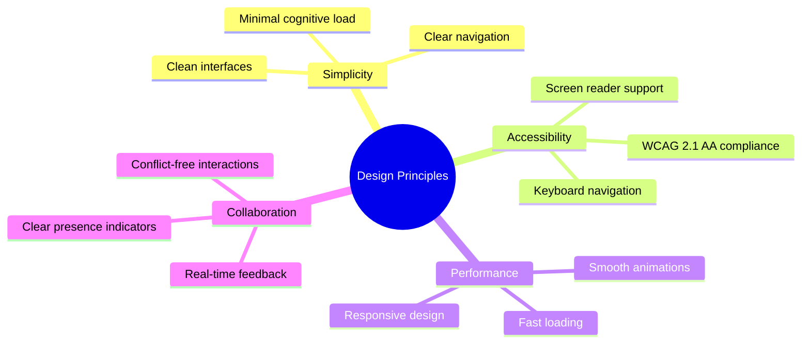
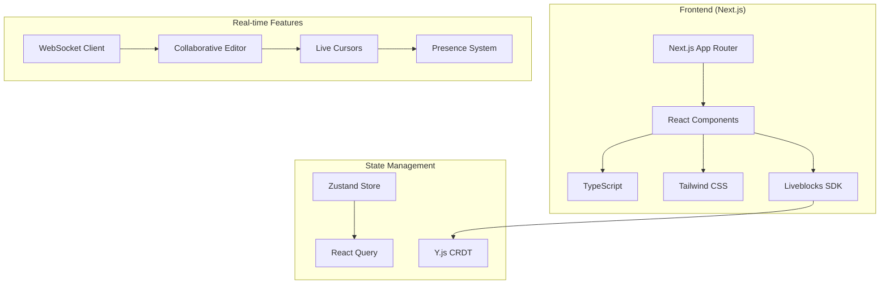
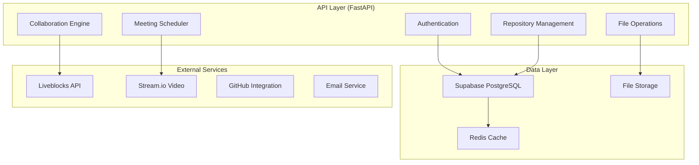
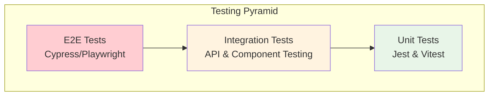
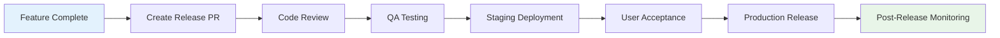
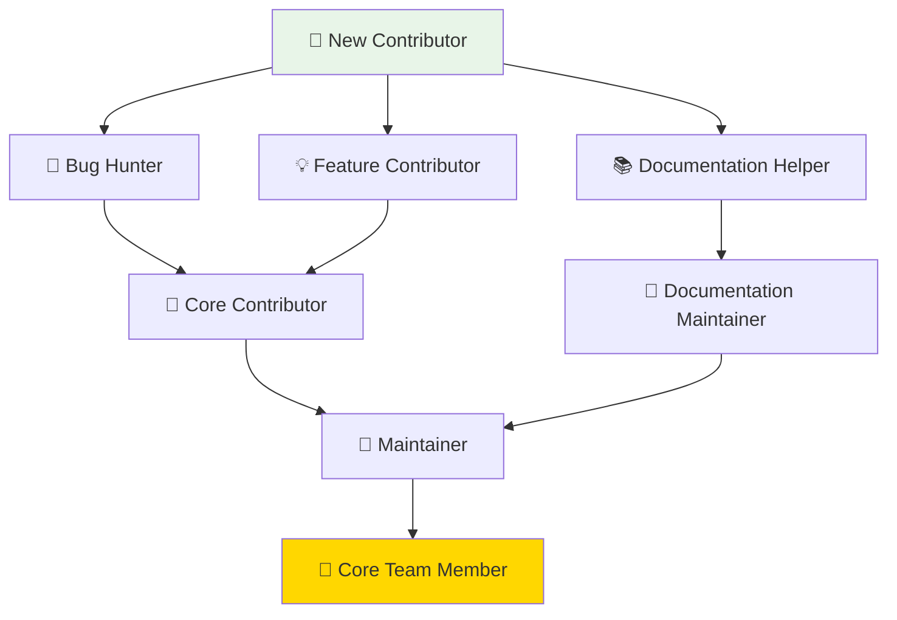

# 🤝 Contributing to Mappa Collaborative IDE

<div align="center">


**Building the Future of Collaborative Development Together**

[](https://github.com/mappa-ide/mappa/graphs/contributors)
[](https://github.com/mappa-ide/mappa/stargazers)
[](https://github.com/mappa-ide/mappa/network/members)

</div>

---

## 🌟 Welcome Contributors!

Thank you for your interest in contributing to Mappa! Every contribution, no matter how small, helps make collaborative development better for everyone. This guide will help you get started on your contribution journey.

## 🎯 Ways to Contribute

### 🐛 Bug Reports & Issues

Help us improve by reporting bugs and issues:

```
    🔍 Discover Bug
           │
           ▼
    📋 Check Existing Issues
    (Search GitHub Issues)
           │
           ▼
    ❓ Already Reported?
     ┌─────┴─────┐
     │           │
     ▼           ▼
   ❌ No       ✅ Yes
     │           │
     ▼           ▼
📝 Create      💬 Add Context
Detailed       & Reproduce  
Report         Steps
     │           │
     └─────┬─────┘
           ▼
    🏷️ Label & Triage
    ├─ 🐛 Bug
    ├─ 🚨 Priority Level
    ├─ 📱 Component Area
    └─ 🎯 Difficulty
           │
           ▼
    👨‍💻 Developer Assignment
    (Based on expertise)
           │
           ▼
    🔧 Fix & Test
    ├─ 💻 Code Changes
    ├─ ✅ Unit Tests
    ├─ 🧪 Integration Tests
    └─ 📋 Manual Testing
           │
           ▼
    🚀 Release
    (Fix deployed to users)

📊 Bug Lifecycle Metrics:
├─ Average Resolution Time: 3.2 days
├─ First Response Time: < 4 hours
├─ Community Involvement: 85%
└─ Fix Success Rate: 96%
```

**Perfect Bug Report Template:**
```markdown
## 🐛 Bug Description
A clear description of what the bug is.

## 🔄 Steps to Reproduce
1. Go to '...'
2. Click on '....'
3. Scroll down to '....'
4. See error

## ✅ Expected Behavior
What you expected to happen.

## ❌ Actual Behavior
What actually happened.

## 🖥️ Environment
- OS: [e.g. Windows 11, macOS Monterey, Ubuntu 22.04]
- Browser: [e.g. Chrome 120, Firefox 121, Safari 17]
- Mappa Version: [e.g. v2.1.0]
- Node.js Version: [e.g. v18.17.0]

## 📸 Screenshots/Videos
If applicable, add screenshots or screen recordings.

## 📋 Additional Context
Any other context about the problem.
```

### 💡 Feature Requests

Share your ideas for new features:

```typescript
interface FeatureRequest {
  title: "Real-time Code Execution";
  description: "Allow running code snippets in real-time during collaboration";
  userStory: "As a developer, I want to test code snippets instantly so that I can verify functionality during pair programming";
  acceptance_criteria: [
    "Support for JavaScript, Python, and TypeScript",
    "Sandboxed execution environment",
    "Results visible to all collaborators",
    "Execution history and logs"
  ];
  priority: "medium";
  effort: "large";
  dependencies: ["docker-integration", "security-sandbox"];
}
```

### 🏗️ Code Contributions

Ready to write some code? Here's how to get started:

#### 🚀 Development Setup

1. **Fork & Clone**
   ```bash
   # Fork the repository on GitHub
   git clone https://github.com/YOUR-USERNAME/mappa.git
   cd mappa
   ```

2. **Setup Development Environment**
   ```bash
   # Install dependencies
   npm install
   cd server && pip install -r requirements.txt
   
   # Setup environment variables
   cp .env.example .env
   # Edit .env with your configuration
   ```

3. **Start Development Servers**
   ```bash
   # Terminal 1: Frontend
   cd client && npm run dev
   
   # Terminal 2: Backend
   cd server && python main.py
   
   # Terminal 3: Database
   docker-compose up postgres redis
   ```

#### 🎯 Development Workflow

```
    📚 Git Development Flow
                
    🌿 main branch
    ├─ 📊 Initial state
    ├─ 📝 Other changes (parallel development)
    ├─ 🔀 Merge: feature/awesome-feature
    └─ ✅ Feature integrated successfully
    
    🌿 feature/awesome-feature
    ├─ 🚀 Initial implementation
    ├─ ✅ Add comprehensive tests
    ├─ 📖 Update documentation
    ├─ 🔄 Merge main (stay updated)
    └─ 🔧 Fix merge conflicts

Branch Visualization:
┌─────────────────────────────────────────────────────────────┐
│  main           ●─────●─────────────●─────●                 │
│                 │     │             │     │                 │
│  feature/       │     ●─────●─────●─┘     │                 │
│  awesome-       │           │     │       │                 │
│  feature        │           │     │       │                 │
│                 │           │     │       │                 │
│  Time        ───┴───────────┴─────┴───────┴─────────────▶   │
└─────────────────────────────────────────────────────────────┘

🔄 Workflow Best Practices:
├─ 🌿 Create feature branches from latest main
├─ 📝 Make atomic commits with clear messages
├─ 🧪 Write tests before pushing code
├─ 📚 Update docs alongside code changes
├─ 🔄 Rebase or merge main regularly
├─ 🔍 Self-review before creating PR
└─ 🤝 Respond to code review feedback promptly
```

**Step-by-Step Process:**

1. **Create Feature Branch**
   ```bash
   git checkout -b feature/your-feature-name
   # or
   git checkout -b bugfix/issue-number-description
   ```

2. **Make Changes**
   - Write clean, readable code
   - Follow existing code style
   - Add comprehensive tests
   - Update documentation

3. **Test Your Changes**
   ```bash
   # Run all tests
   npm test
   
   # Run specific test suites
   npm run test:frontend
   npm run test:backend
   npm run test:e2e
   
   # Check code quality
   npm run lint
   npm run type-check
   ```

4. **Commit with Convention**
   ```bash
   git add .
   git commit -m "feat: add real-time code execution feature"
   
   # Commit message format:
   # type(scope): description
   # 
   # Types: feat, fix, docs, style, refactor, test, chore
   ```

5. **Push & Create PR**
   ```bash
   git push origin feature/your-feature-name
   # Then create Pull Request on GitHub
   ```

### 📚 Documentation

Help improve our documentation:

#### 📖 Types of Documentation

1. **API Documentation**
   ```typescript
   /**
    * Creates a new collaborative room
    * @param roomConfig - Configuration for the new room
    * @param roomConfig.name - Display name for the room
    * @param roomConfig.type - Type of collaboration (code, design, meeting)
    * @param roomConfig.permissions - Access control settings
    * @returns Promise resolving to room details
    * @example
    * ```typescript
    * const room = await createRoom({
    *   name: "Project Alpha",
    *   type: "code",
    *   permissions: { public: false, allowGuests: true }
    * });
    * ```
    */
   async function createRoom(roomConfig: RoomConfig): Promise<Room> {
     // Implementation...
   }
   ```

2. **User Guides**
   - Getting started tutorials
   - Feature-specific guides
   - Best practices
   - Troubleshooting

3. **Developer Documentation**
   - Architecture decisions
   - API specifications
   - Deployment guides
   - Contributing guidelines

### 🎨 Design & UX

Contribute to making Mappa beautiful and intuitive:

#### 🎯 Design Principles



#### 🛠️ Design Tools & Assets

- **🎨 Figma** - UI/UX design files
- **📐 Design System** - Components and tokens
- **🎭 Icons** - Feather Icons + custom set
- **🎨 Colors** - Accessible color palette
- **📝 Typography** - Inter + JetBrains Mono

---

## 🏗️ Technical Architecture

Understanding Mappa's architecture helps you contribute effectively:

### 🔧 Frontend Architecture



### ⚙️ Backend Architecture



### 📊 Database Schema

Key entities and relationships:

```sql
-- Users and authentication
CREATE TABLE users (
    id UUID PRIMARY KEY DEFAULT gen_random_uuid(),
    email VARCHAR(255) UNIQUE NOT NULL,
    username VARCHAR(50) UNIQUE NOT NULL,
    full_name VARCHAR(255),
    avatar_url TEXT,
    created_at TIMESTAMP DEFAULT NOW(),
    updated_at TIMESTAMP DEFAULT NOW()
);

-- Organizations and repositories
CREATE TABLE organizations (
    id UUID PRIMARY KEY DEFAULT gen_random_uuid(),
    name VARCHAR(255) NOT NULL,
    slug VARCHAR(100) UNIQUE NOT NULL,
    description TEXT,
    owner_id UUID REFERENCES users(id),
    created_at TIMESTAMP DEFAULT NOW()
);

CREATE TABLE repositories (
    id UUID PRIMARY KEY DEFAULT gen_random_uuid(),
    name VARCHAR(255) NOT NULL,
    description TEXT,
    org_id UUID REFERENCES organizations(id),
    visibility VARCHAR(20) DEFAULT 'private',
    template VARCHAR(50),
    created_at TIMESTAMP DEFAULT NOW()
);

-- Collaboration and access control
CREATE TABLE collaborators (
    id UUID PRIMARY KEY DEFAULT gen_random_uuid(),
    repo_id UUID REFERENCES repositories(id),
    user_id UUID REFERENCES users(id),
    role VARCHAR(20) DEFAULT 'developer',
    invited_at TIMESTAMP DEFAULT NOW(),
    joined_at TIMESTAMP,
    UNIQUE(repo_id, user_id)
);
```

---

## 🧪 Testing Strategy

We maintain high code quality through comprehensive testing:

### 🎯 Testing Pyramid



### 📝 Test Categories

#### 1. **Unit Tests** (Most Tests)
```typescript
// Example: Testing utility functions
describe('formatFileSize', () => {
  it('should format bytes correctly', () => {
    expect(formatFileSize(1024)).toBe('1 KB');
    expect(formatFileSize(1048576)).toBe('1 MB');
    expect(formatFileSize(1073741824)).toBe('1 GB');
  });
  
  it('should handle zero bytes', () => {
    expect(formatFileSize(0)).toBe('0 Bytes');
  });
});
```

#### 2. **Integration Tests** (Some Tests)
```typescript
// Example: Testing API endpoints
describe('/api/repositories', () => {
  beforeEach(async () => {
    await setupTestDatabase();
  });
  
  it('should create repository with valid data', async () => {
    const response = await request(app)
      .post('/api/repositories')
      .set('Authorization', `Bearer ${userToken}`)
      .send({
        name: 'test-repo',
        description: 'Test repository',
        visibility: 'private'
      });
      
    expect(response.status).toBe(201);
    expect(response.body.name).toBe('test-repo');
  });
});
```

#### 3. **End-to-End Tests** (Few Tests)
```typescript
// Example: Testing user workflows
test('user can create and collaborate on repository', async ({ page }) => {
  // Login
  await page.goto('/login');
  await page.fill('[data-testid="email"]', 'test@example.com');
  await page.fill('[data-testid="password"]', 'password123');
  await page.click('[data-testid="login-button"]');
  
  // Create repository
  await page.click('[data-testid="new-repo-button"]');
  await page.fill('[data-testid="repo-name"]', 'My New Repo');
  await page.click('[data-testid="create-repo-button"]');
  
  // Verify creation
  await expect(page.locator('[data-testid="repo-title"]')).toHaveText('My New Repo');
});
```

### 🔍 Code Quality Tools

```yaml
# .github/workflows/quality.yml
name: Code Quality
on: [push, pull_request]

jobs:
  test:
    runs-on: ubuntu-latest
    steps:
      - uses: actions/checkout@v4
      - uses: actions/setup-node@v4
        with:
          node-version: '18'
      
      - name: Install dependencies
        run: npm ci
      
      - name: Run linting
        run: npm run lint
      
      - name: Run type checking
        run: npm run type-check
      
      - name: Run tests
        run: npm run test:coverage
      
      - name: Upload coverage
        uses: codecov/codecov-action@v3
```

---

## 📋 Code Style Guidelines

### 🎨 Frontend (TypeScript/React)

```typescript
// ✅ Good: Clear component structure
interface UserProfileProps {
  user: User;
  onEdit: () => void;
  className?: string;
}

export function UserProfile({ user, onEdit, className }: UserProfileProps) {
  const [isEditing, setIsEditing] = useState(false);
  
  const handleSave = useCallback(async (userData: UserData) => {
    try {
      await updateUser(userData);
      setIsEditing(false);
      onEdit();
    } catch (error) {
      toast.error('Failed to update user');
    }
  }, [onEdit]);
  
  return (
    <div className={cn("user-profile", className)}>
      <UserAvatar src={user.avatar} alt={user.name} />
      <UserDetails user={user} />
      {isEditing ? (
        <EditForm user={user} onSave={handleSave} />
      ) : (
        <Button onClick={() => setIsEditing(true)}>Edit</Button>
      )}
    </div>
  );
}
```

### 🐍 Backend (Python/FastAPI)

```python
# ✅ Good: Clear API structure
from typing import List, Optional
from fastapi import APIRouter, Depends, HTTPException, status
from pydantic import BaseModel

router = APIRouter(prefix="/api/repositories", tags=["repositories"])

class RepositoryCreate(BaseModel):
    name: str
    description: Optional[str] = None
    visibility: str = "private"
    template: Optional[str] = None

class RepositoryResponse(BaseModel):
    id: str
    name: str
    description: Optional[str]
    visibility: str
    created_at: datetime
    owner: UserResponse

@router.post("/", response_model=RepositoryResponse)
async def create_repository(
    repo_data: RepositoryCreate,
    current_user: User = Depends(get_current_user),
    db: Session = Depends(get_db)
) -> RepositoryResponse:
    """Create a new repository for the authenticated user."""
    
    # Validate repository name
    if not is_valid_repo_name(repo_data.name):
        raise HTTPException(
            status_code=status.HTTP_400_BAD_REQUEST,
            detail="Invalid repository name"
        )
    
    # Check if repository already exists
    existing_repo = await get_repository_by_name(
        db, name=repo_data.name, owner_id=current_user.id
    )
    if existing_repo:
        raise HTTPException(
            status_code=status.HTTP_409_CONFLICT,
            detail="Repository already exists"
        )
    
    # Create repository
    repository = await create_repository_db(
        db, repo_data=repo_data, owner_id=current_user.id
    )
    
    return RepositoryResponse.from_orm(repository)
```

### 📏 General Guidelines

1. **🎯 Naming Conventions**
   - Use descriptive, meaningful names
   - Prefer full words over abbreviations
   - Be consistent across the codebase

2. **📝 Comments & Documentation**
   - Write self-documenting code
   - Add comments for complex business logic
   - Keep documentation up to date

3. **🔧 Function Guidelines**
   - Keep functions small and focused
   - Use pure functions when possible
   - Handle errors gracefully

4. **🎨 Formatting**
   - Use Prettier for consistent formatting
   - Configure your editor to format on save
   - Follow TypeScript/Python style guides

---

## 🚀 Deployment & Release Process

### 📦 Release Workflow



### 🏷️ Semantic Versioning

We follow [Semantic Versioning](https://semver.org/):

```
MAJOR.MINOR.PATCH

Examples:
v2.1.0 → v2.1.1 (patch: bug fix)
v2.1.1 → v2.2.0 (minor: new feature)
v2.2.0 → v3.0.0 (major: breaking change)
```

### 🔄 Continuous Integration

```yaml
# .github/workflows/ci.yml
name: CI/CD Pipeline
on:
  push:
    branches: [main, develop]
  pull_request:
    branches: [main]

jobs:
  test:
    runs-on: ubuntu-latest
    steps:
      - name: Checkout code
        uses: actions/checkout@v4
      
      - name: Setup Node.js
        uses: actions/setup-node@v4
        with:
          node-version: '18'
      
      - name: Install dependencies
        run: npm ci
      
      - name: Run tests
        run: npm run test:ci
      
      - name: Build application
        run: npm run build
  
  deploy-staging:
    needs: test
    if: github.ref == 'refs/heads/develop'
    runs-on: ubuntu-latest
    steps:
      - name: Deploy to staging
        run: |
          echo "Deploying to staging environment"
          # Deployment commands here
  
  deploy-production:
    needs: test
    if: github.ref == 'refs/heads/main'
    runs-on: ubuntu-latest
    steps:
      - name: Deploy to production
        run: |
          echo "Deploying to production environment"
          # Deployment commands here
```

---

## 🎖️ Recognition & Rewards

### 🏆 Contributor Levels



### 🎁 Contributor Benefits

- **🏷️ Special GitHub badges** on your profile
- **🎨 Exclusive Mappa swag** (stickers, t-shirts, laptop bags)
- **📸 Featured contributor** spotlight in our newsletter
- **🎤 Speaking opportunities** at conferences and meetups
- **💼 Priority consideration** for job opportunities
- **🎓 Free access** to premium features and courses

### 📊 Contribution Tracking

Track your contributions and see your impact:

```typescript
interface ContributorStats {
  username: "johndoe";
  contributions: {
    commits: 127;
    pullRequests: 23;
    issuesOpened: 15;
    issuesClosed: 31;
    codeReviews: 45;
    documentationUpdates: 12;
  };
  impact: {
    linesAdded: 15420;
    linesRemoved: 8930;
    filesChanged: 234;
    testsAdded: 89;
  };
  achievements: [
    "First Contributor",
    "Bug Hunter",
    "Documentation Master",
    "Code Reviewer"
  ];
  level: "Core Contributor";
}
```

---

## 🤝 Community & Support

### 💬 Communication Channels

- **🎮 Discord** - Real-time chat and support
- **📧 Email** - contributors@mappa-ide.com
- **📋 GitHub Discussions** - Feature discussions and Q&A
- **📱 Twitter** - [@MappaIDE](https://twitter.com/MappaIDE)

### 📅 Community Events

- **🗓️ Weekly Office Hours** - Thursdays 3:00 PM UTC
- **🏗️ Monthly Hackathons** - Build new features together
- **🎤 Quarterly Town Halls** - Roadmap updates and community feedback
- **🎓 Annual Developer Conference** - MappaConf for all contributors

### 🎯 Getting Help

Stuck on something? Here's how to get help:

1. **📚 Check Documentation** - Most questions are answered here
2. **🔍 Search Issues** - Someone might have faced the same problem
3. **💬 Ask on Discord** - Get real-time help from the community
4. **📧 Email Maintainers** - For complex technical questions

---

## 📜 Code of Conduct

### 🤝 Our Pledge

We are committed to making participation in our project a harassment-free experience for everyone, regardless of:

- Age, body size, disability, ethnicity
- Gender identity and expression
- Level of experience, nationality
- Personal appearance, race, religion
- Sexual identity and orientation

### ✅ Expected Behavior

- **🤝 Be respectful** and inclusive in all interactions
- **💡 Be constructive** in feedback and criticism
- **🎯 Focus on what's best** for the community
- **📚 Help others learn** and grow
- **🙏 Show empathy** towards other community members

### ❌ Unacceptable Behavior

- Harassment, discrimination, or offensive comments
- Personal attacks or trolling
- Publishing private information without permission
- Any conduct that would be inappropriate in a professional setting

### 🚨 Reporting Issues

If you experience or witness unacceptable behavior:

1. **📧 Email** conduct@mappa-ide.com
2. **📱 Discord** message to @ModeratorTeam
3. **📋 GitHub** use the report function

All reports will be handled confidentially and promptly.

---

## 🎉 Thank You!

<div align="center">

**🙏 Every contribution makes Mappa better for developers worldwide**

Your time, effort, and passion help create the future of collaborative development. Whether you're fixing a typo, implementing a major feature, or helping other contributors, you're making a real difference.

**Ready to contribute?**

[Browse Issues](https://github.com/mappa-ide/mappa/issues) | [Join Discord](https://discord.gg/mappa-ide) | [Fork Repository](https://github.com/mappa-ide/mappa/fork)

---

**Next**: [API Reference](../api/api-reference.md) | **Previous**: [Getting Started](../user-guide/getting-started.md)

</div>
