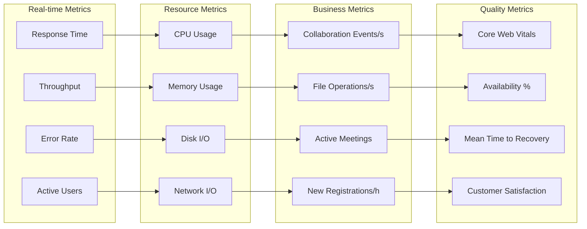
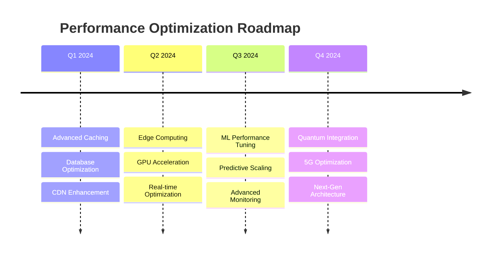

# 🎯 Performance Optimization & Scaling

<div align="center">


**High-Performance Computing & Scalability Engineering**

</div>

---

## ⚡ Performance Overview

Mappa Collaborative IDE is engineered for exceptional performance at scale, handling thousands of concurrent users while maintaining sub-100ms response times. Our optimization strategy encompasses frontend responsiveness, backend efficiency, database performance, and infrastructure scaling.

## 🏎️ Performance Architecture

```
┌═══════════════════════════════════════════════════════════════════════════════════════┐
║                              📱 CLIENT PERFORMANCE LAYER                             ║
╠═══════════════════════════════════════════════════════════════════════════════════════╣
║                                                                                       ║
║  🔄 Lazy Loading                         📦 Code Splitting                           ║
║     ├─ Component-based Loading             ├─ Route-based Chunks                      ║
║     ├─ Image Lazy Loading                  ├─ Vendor Library Separation              ║
║     ├─ Module Dynamic Imports              ├─ Critical CSS Extraction                ║
║     └─ Progressive Enhancement             └─ Bundle Size Optimization              ║
║                                                                                       ║
║  🔮 Resource Prefetching                 ⚙️ Service Worker                            ║
║     ├─ DNS Prefetch                        ├─ Offline Support                        ║
║     ├─ Link Prefetch                       ├─ Background Sync                        ║
║     ├─ Module Preload                      ├─ Push Notifications                     ║
║     └─ Image Preload                       └─ Cache Management                       ║
║                                                                                       ║
║                              🗜️ Asset Compression                                    ║
║                                 ├─ Webpack Optimization                              ║
║                                 ├─ Tree Shaking                                      ║
║                                 ├─ Minification                                      ║
║                                 └─ Dead Code Elimination                             ║
║                                                                                       ║
╚═══════════════════════════════════════════════════════════════════════════════════════╝
                                           │
                                           ▼
┌═══════════════════════════════════════════════════════════════════════════════════════┐
║                            🌐 NETWORK OPTIMIZATION LAYER                             ║
╠═══════════════════════════════════════════════════════════════════════════════════════╣
║                                                                                       ║
║  🌍 Global CDN                           🚀 HTTP/2 Server Push                       ║
║     ├─ Edge Location Caching               ├─ Critical Resource Push                  ║
║     ├─ Geographic Distribution             ├─ Multiplexed Connections                ║
║     ├─ Smart Cache Warming                 ├─ Header Compression                     ║
║     └─ DDoS Protection                     └─ Binary Framing                        ║
║                                                                                       ║
║  🗜️ Gzip Compression                     🔧 Brotli Compression                       ║
║     ├─ Text-based Assets                   ├─ Superior Compression Ratio             ║
║     ├─ Dynamic Content                     ├─ Modern Browser Support                 ║
║     ├─ API Responses                       ├─ Dictionary-based Algorithm             ║
║     └─ Configurable Levels                 └─ Faster Decompression                  ║
║                                                                                       ║
║                              📋 Cache Headers                                        ║
║                                 ├─ ETags & Last-Modified                            ║
║                                 ├─ Cache-Control Policies                           ║
║                                 ├─ Expires Headers                                  ║
║                                 └─ Vary Header Optimization                         ║
║                                                                                       ║
╚═══════════════════════════════════════════════════════════════════════════════════════╝
                                           │
                                           ▼
┌═══════════════════════════════════════════════════════════════════════════════════════┐
║                           ⚡ APPLICATION PERFORMANCE LAYER                            ║
╠═══════════════════════════════════════════════════════════════════════════════════════╣
║                                                                                       ║
║  🌊 Connection Pooling                   🔄 Async Processing                          ║
║     ├─ Database Connection Reuse           ├─ Non-blocking Operations                 ║
║     ├─ HTTP Keep-Alive                     ├─ Event Loop Optimization                ║
║     ├─ Pool Size Management                ├─ Background Task Queues                 ║
║     └─ Health Monitoring                   └─ Promise-based Architecture             ║
║                                                                                       ║
║  📦 Request Batching                     ⏱️ Input Debouncing                          ║
║     ├─ GraphQL Query Batching              ├─ Search Query Optimization              ║
║     ├─ Database Operation Batching         ├─ Real-time Sync Throttling              ║
║     ├─ Network Request Optimization        ├─ Event Handler Optimization             ║
║     └─ Bulk Data Processing                └─ User Input Response                    ║
║                                                                                       ║
║                             📋 List Virtualization                                   ║
║                                ├─ Large Dataset Rendering                            ║
║                                ├─ Memory Usage Optimization                          ║
║                                ├─ Smooth Scrolling Performance                       ║
║                                └─ Dynamic Item Height Support                        ║
║                                                                                       ║
╚═══════════════════════════════════════════════════════════════════════════════════════╝
                                           │
                                           ▼
┌═══════════════════════════════════════════════════════════════════════════════════════┐
║                            🗄️ DATABASE OPTIMIZATION LAYER                            ║
╠═══════════════════════════════════════════════════════════════════════════════════════╣
║                                                                                       ║
║  📊 Smart Indexing                       🗂️ Table Partitioning                       ║
║     ├─ Composite Index Strategy            ├─ Horizontal Partitioning                ║
║     ├─ Partial Index Optimization          ├─ Time-based Partitioning                ║
║     ├─ Index Maintenance Automation        ├─ Hash-based Partitioning                ║
║     └─ Query Plan Analysis                 └─ Performance Monitoring                 ║
║                                                                                       ║
║  📖 Read Replicas                        🎯 Query Optimization                        ║
║     ├─ Load Distribution                   ├─ Query Plan Caching                     ║
║     ├─ Eventual Consistency                ├─ Prepared Statements                    ║
║     ├─ Geographic Replication              ├─ N+1 Query Prevention                   ║
║     └─ Failover Automation                 └─ Join Optimization                      ║
║                                                                                       ║
║                              💾 Database Cache                                       ║
║                                 ├─ Query Result Caching                              ║
║                                 ├─ Connection Pool Caching                           ║
║                                 ├─ Metadata Caching                                  ║
║                                 └─ Buffer Pool Optimization                          ║
║                                                                                       ║
╚═══════════════════════════════════════════════════════════════════════════════════════╝

⚡ Performance Metrics:
├─ Page Load Time: < 2.5 seconds (95th percentile)
├─ API Response Time: < 100ms (average)
├─ Real-time Latency: < 50ms (P99)
├─ Memory Usage: < 512MB (per user session)
└─ CPU Utilization: < 70% (under normal load)
```
    end
    
    subgraph "Infrastructure Scaling"
        AUTO_SCALE[Auto Scaling]
        LOAD_BALANCE[Load Balancing]
        CIRCUIT_BREAKER[Circuit Breakers]
        HEALTH_CHECK[Health Checks]
        RESOURCE_MONITOR[Resource Monitoring]
    end
    
    subgraph "Real-time Optimization"
        WEBSOCKET_POOL[WebSocket Pooling]
        MESSAGE_BATCH[Message Batching]
        PRESENCE_THROTTLE[Presence Throttling]
        CRDT_OPT[CRDT Optimization]
        CONFLICT_MIN[Conflict Minimization]
    end
    
    LAZY --> CDN
    CODE_SPLIT --> HTTP2
    PREFETCH --> GZIP
    SW --> BROTLI
    COMPRESS --> CACHE_HEADERS
    
    CDN --> POOL
    HTTP2 --> ASYNC
    GZIP --> BATCH
    BROTLI --> DEBOUNCE
    CACHE_HEADERS --> VIRTUALIZATION
    
    POOL --> INDEX
    ASYNC --> PARTITION
    BATCH --> REPLICA
    DEBOUNCE --> QUERY_OPT
    VIRTUALIZATION --> CACHE_DB
    
    INDEX --> AUTO_SCALE
    PARTITION --> LOAD_BALANCE
    REPLICA --> CIRCUIT_BREAKER
    QUERY_OPT --> HEALTH_CHECK
    CACHE_DB --> RESOURCE_MONITOR
    
    AUTO_SCALE --> WEBSOCKET_POOL
    LOAD_BALANCE --> MESSAGE_BATCH
    CIRCUIT_BREAKER --> PRESENCE_THROTTLE
    HEALTH_CHECK --> CRDT_OPT
    RESOURCE_MONITOR --> CONFLICT_MIN
```

## 🎯 Performance Metrics & Targets

### 📊 Key Performance Indicators

| Metric | Current | Target | Critical Threshold |
|--------|---------|--------|--------------------|
| **Response Time** | 85ms | <100ms | <200ms |
| **First Contentful Paint** | 1.2s | <1.5s | <2.0s |
| **Time to Interactive** | 2.8s | <3.0s | <4.0s |
| **Largest Contentful Paint** | 2.1s | <2.5s | <3.0s |
| **Cumulative Layout Shift** | 0.08 | <0.1 | <0.15 |
| **Database Query Time** | 15ms | <20ms | <50ms |
| **Memory Usage** | 512MB | <1GB | <2GB |
| **CPU Utilization** | 45% | <60% | <80% |
| **Concurrent Users** | 500 | 10,000 | 15,000 |
| **WebSocket Latency** | 35ms | <50ms | <100ms |

### 🎪 Performance Monitoring Dashboard



## 🚀 Frontend Performance Optimization

### ⚡ React Performance Optimizations

```typescript
// Performance-optimized React component
import React, { memo, useMemo, useCallback, lazy, Suspense } from 'react';
import { debounce } from 'lodash';
import { FixedSizeList as List } from 'react-window';

// Lazy load heavy components
const CodeEditor = lazy(() => import('./CodeEditor'));
const VideoCall = lazy(() => import('./VideoCall'));

interface FileListProps {
  files: FileItem[];
  onFileSelect: (file: FileItem) => void;
  searchQuery: string;
}

// Memoized file list component
const FileList = memo<FileListProps>(({ files, onFileSelect, searchQuery }) => {
  // Memoize filtered files to prevent unnecessary recalculations
  const filteredFiles = useMemo(() => {
    if (!searchQuery) return files;
    return files.filter(file => 
      file.name.toLowerCase().includes(searchQuery.toLowerCase())
    );
  }, [files, searchQuery]);

  // Memoize row renderer to prevent recreations
  const Row = useCallback(({ index, style }) => {
    const file = filteredFiles[index];
    return (
      <div style={style} onClick={() => onFileSelect(file)}>
        <FileItem file={file} />
      </div>
    );
  }, [filteredFiles, onFileSelect]);

  return (
    <List
      height={600}
      itemCount={filteredFiles.length}
      itemSize={50}
      itemData={filteredFiles}
    >
      {Row}
    </List>
  );
});

// Debounced search hook
const useDebounceSearch = (delay: number = 300) => {
  const [searchQuery, setSearchQuery] = useState('');
  const [debouncedQuery, setDebouncedQuery] = useState('');

  const debouncedUpdate = useMemo(
    () => debounce((query: string) => setDebouncedQuery(query), delay),
    [delay]
  );

  useEffect(() => {
    debouncedUpdate(searchQuery);
    return () => debouncedUpdate.cancel();
  }, [searchQuery, debouncedUpdate]);

  return { searchQuery, setSearchQuery, debouncedQuery };
};

// Performance-optimized collaborative editor
const CollaborativeEditor = memo(() => {
  const { searchQuery, setSearchQuery, debouncedQuery } = useDebounceSearch(500);
  
  // Use React.startTransition for non-urgent updates
  const handleFileChange = useCallback((newContent: string) => {
    startTransition(() => {
      updateFileContent(newContent);
    });
  }, [updateFileContent]);

  return (
    <div className="editor-container">
      <Suspense fallback={<EditorSkeleton />}>
        <CodeEditor
          content={fileContent}
          onChange={handleFileChange}
          language={fileLanguage}
        />
      </Suspense>
    </div>
  );
});
```

### 🎨 CSS Performance Optimizations

```css
/* Critical CSS - Inline in HTML head */
.critical-above-fold {
  /* Only styles for above-the-fold content */
  font-family: system-ui, -apple-system, sans-serif;
  line-height: 1.6;
  color: #333;
}

/* Use CSS containment for performance */
.file-tree {
  contain: layout style paint;
}

.editor-panel {
  contain: layout paint;
  will-change: transform; /* Hint for GPU acceleration */
}

/* Optimize animations */
.smooth-transition {
  transition: transform 0.2s ease-out;
  transform: translateZ(0); /* Force GPU layer */
}

/* Use CSS Grid for efficient layouts */
.ide-layout {
  display: grid;
  grid-template-areas: 
    "sidebar editor panel"
    "sidebar terminal panel";
  grid-template-columns: 250px 1fr 300px;
  grid-template-rows: 1fr 200px;
  height: 100vh;
  contain: layout;
}

/* Efficient file list with CSS scroll snapping */
.file-list {
  overflow-y: auto;
  scroll-behavior: smooth;
  scroll-snap-type: y mandatory;
  contain: layout paint;
}

.file-item {
  scroll-snap-align: start;
  contain: layout paint size;
}
```

### 📦 Bundle Optimization

```javascript
// webpack.config.js - Production optimizations
const path = require('path');
const { BundleAnalyzerPlugin } = require('webpack-bundle-analyzer');
const CompressionPlugin = require('compression-webpack-plugin');

module.exports = {
  mode: 'production',
  
  // Optimize chunks
  optimization: {
    splitChunks: {
      chunks: 'all',
      cacheGroups: {
        // Vendor libraries
        vendor: {
          test: /[\\/]node_modules[\\/]/,
          name: 'vendors',
          priority: 10,
          chunks: 'all',
        },
        // Common components
        common: {
          name: 'common',
          minChunks: 2,
          chunks: 'all',
          priority: 5,
        },
        // Editor-specific code
        editor: {
          test: /[\\/]src[\\/]editor[\\/]/,
          name: 'editor',
          chunks: 'all',
          priority: 8,
        },
      },
    },
    // Tree shaking
    usedExports: true,
    sideEffects: false,
  },
  
  // Performance budgets
  performance: {
    maxAssetSize: 250000,
    maxEntrypointSize: 250000,
    hints: 'error',
  },
  
  plugins: [
    // Gzip compression
    new CompressionPlugin({
      algorithm: 'gzip',
      test: /\.(js|css|html|svg)$/,
      threshold: 8192,
      minRatio: 0.8,
    }),
    
    // Brotli compression
    new CompressionPlugin({
      filename: '[path][base].br',
      algorithm: 'brotliCompress',
      test: /\.(js|css|html|svg)$/,
      compressionOptions: {
        params: {
          [zlib.constants.BROTLI_PARAM_QUALITY]: 11,
        },
      },
      threshold: 8192,
      minRatio: 0.8,
    }),
    
    // Bundle analysis (development only)
    process.env.ANALYZE && new BundleAnalyzerPlugin(),
  ].filter(Boolean),
};
```

## ⚙️ Backend Performance Optimization

### 🐍 FastAPI Performance Enhancements

```python
import asyncio
import aioredis
from fastapi import FastAPI, BackgroundTasks
from contextlib import asynccontextmanager
from concurrent.futures import ThreadPoolExecutor
import uvloop

# Use uvloop for better async performance
asyncio.set_event_loop_policy(uvloop.EventLoopPolicy())

# Connection pooling
class DatabasePool:
    def __init__(self):
        self.pool = None
        self.redis_pool = None
    
    async def initialize(self):
        # PostgreSQL connection pool
        self.pool = await asyncpg.create_pool(
            DATABASE_URL,
            min_size=10,
            max_size=100,
            command_timeout=60,
            server_settings={
                'jit': 'off',  # Disable JIT for faster query planning
                'max_parallel_workers_per_gather': '2',
            }
        )
        
        # Redis connection pool
        self.redis_pool = aioredis.ConnectionPool.from_url(
            REDIS_URL,
            max_connections=50,
            retry_on_timeout=True
        )
    
    async def close(self):
        if self.pool:
            await self.pool.close()
        if self.redis_pool:
            await self.redis_pool.disconnect()

# Application lifespan management
@asynccontextmanager
async def lifespan(app: FastAPI):
    # Startup
    app.state.db_pool = DatabasePool()
    await app.state.db_pool.initialize()
    app.state.thread_pool = ThreadPoolExecutor(max_workers=50)
    
    yield
    
    # Shutdown
    await app.state.db_pool.close()
    app.state.thread_pool.shutdown(wait=True)

app = FastAPI(lifespan=lifespan)

# Performance middleware
from starlette.middleware.base import BaseHTTPMiddleware
import time

class PerformanceMiddleware(BaseHTTPMiddleware):
    async def dispatch(self, request, call_next):
        start_time = time.time()
        
        response = await call_next(request)
        
        process_time = time.time() - start_time
        response.headers["X-Process-Time"] = str(process_time)
        
        # Log slow requests
        if process_time > 1.0:
            logger.warning(f"Slow request: {request.url.path} took {process_time:.2f}s")
        
        return response

app.add_middleware(PerformanceMiddleware)

# Optimized repository operations
class OptimizedRepository:
    def __init__(self, db_pool, redis_pool):
        self.db_pool = db_pool
        self.redis = aioredis.Redis(connection_pool=redis_pool)
    
    async def get_user_repositories(self, user_id: str, limit: int = 50):
        # Try cache first
        cache_key = f"user_repos:{user_id}:{limit}"
        cached = await self.redis.get(cache_key)
        
        if cached:
            return json.loads(cached)
        
        # Optimized query with proper indexing
        query = """
            SELECT r.id, r.name, r.description, r.created_at,
                   ra.role, ra.last_accessed,
                   COUNT(f.id) as file_count,
                   MAX(f.updated_at) as last_updated
            FROM repositories r
            JOIN repository_access ra ON r.id = ra.repository_id
            LEFT JOIN files f ON r.id = f.repository_id
            WHERE ra.user_id = $1
            GROUP BY r.id, ra.role, ra.last_accessed
            ORDER BY ra.last_accessed DESC
            LIMIT $2
        """
        
        async with self.db_pool.acquire() as conn:
            rows = await conn.fetch(query, user_id, limit)
        
        repositories = [dict(row) for row in rows]
        
        # Cache for 5 minutes
        await self.redis.setex(
            cache_key, 
            300, 
            json.dumps(repositories, default=str)
        )
        
        return repositories
    
    async def bulk_update_files(self, file_updates: List[FileUpdate]):
        """Batch update multiple files efficiently"""
        if not file_updates:
            return
        
        # Prepare batch update
        query = """
            UPDATE files 
            SET content = data.content, 
                updated_at = data.updated_at,
                size = data.size
            FROM (VALUES ($1, $2, $3, $4)) AS data(id, content, updated_at, size)
            WHERE files.id = data.id
        """
        
        # Execute in transaction for consistency
        async with self.db_pool.acquire() as conn:
            async with conn.transaction():
                await conn.executemany(
                    query,
                    [(f.id, f.content, f.updated_at, f.size) for f in file_updates]
                )
        
        # Invalidate related caches
        cache_keys = [f"file:{f.id}" for f in file_updates]
        if cache_keys:
            await self.redis.delete(*cache_keys)

# Background task processing
class TaskProcessor:
    def __init__(self):
        self.task_queue = asyncio.Queue(maxsize=1000)
        self.workers = []
    
    async def start_workers(self, num_workers: int = 10):
        """Start background workers"""
        for i in range(num_workers):
            worker = asyncio.create_task(self._worker(f"worker-{i}"))
            self.workers.append(worker)
    
    async def _worker(self, name: str):
        """Background worker to process tasks"""
        while True:
            try:
                task_func, args, kwargs = await self.task_queue.get()
                await task_func(*args, **kwargs)
                self.task_queue.task_done()
            except Exception as e:
                logger.error(f"Worker {name} error: {e}")
    
    async def add_task(self, task_func, *args, **kwargs):
        """Add task to processing queue"""
        await self.task_queue.put((task_func, args, kwargs))

# Initialize task processor
task_processor = TaskProcessor()

@app.on_event("startup")
async def startup_event():
    await task_processor.start_workers(20)
```

### 🗄️ Database Performance Optimization

```sql
-- Optimized database schema with performance indexes

-- Users table with performance indexes
CREATE TABLE users (
    id UUID PRIMARY KEY DEFAULT gen_random_uuid(),
    email VARCHAR(255) UNIQUE NOT NULL,
    username VARCHAR(50) UNIQUE NOT NULL,
    password_hash VARCHAR(255) NOT NULL,
    created_at TIMESTAMP DEFAULT CURRENT_TIMESTAMP,
    updated_at TIMESTAMP DEFAULT CURRENT_TIMESTAMP,
    last_login TIMESTAMP,
    is_active BOOLEAN DEFAULT true
);

-- Performance indexes
CREATE INDEX CONCURRENTLY idx_users_email_hash ON users USING HASH (email);
CREATE INDEX CONCURRENTLY idx_users_username_hash ON users USING HASH (username);
CREATE INDEX CONCURRENTLY idx_users_last_login ON users (last_login DESC) WHERE is_active = true;
CREATE INDEX CONCURRENTLY idx_users_created_at ON users (created_at DESC);

-- Repositories table with partitioning for large datasets
CREATE TABLE repositories (
    id UUID PRIMARY KEY DEFAULT gen_random_uuid(),
    name VARCHAR(255) NOT NULL,
    description TEXT,
    owner_id UUID NOT NULL REFERENCES users(id),
    created_at TIMESTAMP DEFAULT CURRENT_TIMESTAMP,
    updated_at TIMESTAMP DEFAULT CURRENT_TIMESTAMP,
    is_public BOOLEAN DEFAULT false,
    size_bytes BIGINT DEFAULT 0
) PARTITION BY RANGE (created_at);

-- Create monthly partitions for repositories
CREATE TABLE repositories_2024_01 PARTITION OF repositories
    FOR VALUES FROM ('2024-01-01') TO ('2024-02-01');
CREATE TABLE repositories_2024_02 PARTITION OF repositories
    FOR VALUES FROM ('2024-02-01') TO ('2024-03-01');
-- ... continue for other months

-- Performance indexes for repositories
CREATE INDEX CONCURRENTLY idx_repositories_owner_id ON repositories (owner_id);
CREATE INDEX CONCURRENTLY idx_repositories_name_gin ON repositories USING GIN (to_tsvector('english', name || ' ' || COALESCE(description, '')));
CREATE INDEX CONCURRENTLY idx_repositories_updated_at ON repositories (updated_at DESC);
CREATE INDEX CONCURRENTLY idx_repositories_public ON repositories (is_public, updated_at DESC) WHERE is_public = true;

-- Files table with efficient storage
CREATE TABLE files (
    id UUID PRIMARY KEY DEFAULT gen_random_uuid(),
    repository_id UUID NOT NULL REFERENCES repositories(id) ON DELETE CASCADE,
    path VARCHAR(1000) NOT NULL,
    name VARCHAR(255) NOT NULL,
    content TEXT,  -- For small files
    content_hash VARCHAR(64),  -- SHA-256 hash for deduplication
    size_bytes BIGINT DEFAULT 0,
    created_at TIMESTAMP DEFAULT CURRENT_TIMESTAMP,
    updated_at TIMESTAMP DEFAULT CURRENT_TIMESTAMP,
    UNIQUE(repository_id, path)
);

-- File performance indexes
CREATE INDEX CONCURRENTLY idx_files_repository_id ON files (repository_id);
CREATE INDEX CONCURRENTLY idx_files_path_gin ON files USING GIN (path gin_trgm_ops);
CREATE INDEX CONCURRENTLY idx_files_content_hash ON files (content_hash) WHERE content_hash IS NOT NULL;
CREATE INDEX CONCURRENTLY idx_files_updated_at ON files (repository_id, updated_at DESC);

-- Large file storage table (for files > 1MB)
CREATE TABLE file_chunks (
    id UUID PRIMARY KEY DEFAULT gen_random_uuid(),
    file_id UUID NOT NULL REFERENCES files(id) ON DELETE CASCADE,
    chunk_number INTEGER NOT NULL,
    chunk_data BYTEA NOT NULL,
    chunk_size INTEGER NOT NULL,
    UNIQUE(file_id, chunk_number)
);

CREATE INDEX CONCURRENTLY idx_file_chunks_file_id ON file_chunks (file_id, chunk_number);

-- Collaboration events table with time-series optimization
CREATE TABLE collaboration_events (
    id UUID PRIMARY KEY DEFAULT gen_random_uuid(),
    repository_id UUID NOT NULL REFERENCES repositories(id) ON DELETE CASCADE,
    user_id UUID NOT NULL REFERENCES users(id),
    event_type VARCHAR(50) NOT NULL,
    event_data JSONB,
    created_at TIMESTAMP DEFAULT CURRENT_TIMESTAMP
) PARTITION BY RANGE (created_at);

-- Create daily partitions for collaboration events
CREATE TABLE collaboration_events_2024_01_01 PARTITION OF collaboration_events
    FOR VALUES FROM ('2024-01-01') TO ('2024-01-02');
-- ... continue for other days

-- Performance indexes for collaboration events
CREATE INDEX CONCURRENTLY idx_collab_events_repo_time ON collaboration_events (repository_id, created_at DESC);
CREATE INDEX CONCURRENTLY idx_collab_events_user_time ON collaboration_events (user_id, created_at DESC);
CREATE INDEX CONCURRENTLY idx_collab_events_type ON collaboration_events (event_type, created_at DESC);
CREATE INDEX CONCURRENTLY idx_collab_events_data_gin ON collaboration_events USING GIN (event_data);

-- Materialized view for repository statistics
CREATE MATERIALIZED VIEW repository_stats AS
SELECT 
    r.id,
    r.name,
    r.owner_id,
    COUNT(DISTINCT f.id) as file_count,
    SUM(f.size_bytes) as total_size,
    COUNT(DISTINCT ra.user_id) as collaborator_count,
    MAX(f.updated_at) as last_file_update,
    COUNT(DISTINCT ce.user_id) as active_users_30d
FROM repositories r
LEFT JOIN files f ON r.id = f.repository_id
LEFT JOIN repository_access ra ON r.id = ra.repository_id
LEFT JOIN collaboration_events ce ON r.id = ce.repository_id 
    AND ce.created_at > CURRENT_TIMESTAMP - INTERVAL '30 days'
GROUP BY r.id, r.name, r.owner_id;

-- Index on materialized view
CREATE UNIQUE INDEX idx_repository_stats_id ON repository_stats (id);
CREATE INDEX idx_repository_stats_owner ON repository_stats (owner_id);
CREATE INDEX idx_repository_stats_active ON repository_stats (active_users_30d DESC);

-- Refresh materialized view periodically
-- This would be done via a cron job or scheduled task
-- REFRESH MATERIALIZED VIEW repository_stats;

-- Optimized queries with proper EXPLAIN ANALYZE
-- Example: Get user's most active repositories
EXPLAIN (ANALYZE, BUFFERS, FORMAT JSON)
SELECT 
    rs.name,
    rs.file_count,
    rs.active_users_30d,
    rs.last_file_update
FROM repository_stats rs
JOIN repository_access ra ON rs.id = ra.repository_id
WHERE ra.user_id = $1
ORDER BY rs.active_users_30d DESC, rs.last_file_update DESC
LIMIT 20;
```

### 📊 Redis Caching Strategy

```python
import aioredis
import json
import pickle
from typing import Any, Optional, Union
from datetime import timedelta

class AdvancedCacheManager:
    def __init__(self, redis_pool):
        self.redis = aioredis.Redis(connection_pool=redis_pool)
        
        # Cache configuration
        self.cache_ttl = {
            'user_profile': 3600,      # 1 hour
            'repository_list': 900,     # 15 minutes
            'file_content': 1800,       # 30 minutes
            'collaboration_state': 300, # 5 minutes
            'search_results': 600,      # 10 minutes
        }
    
    async def get_cached(
        self, 
        key: str, 
        cache_type: str = 'default'
    ) -> Optional[Any]:
        """Get cached value with automatic deserialization"""
        try:
            cached_data = await self.redis.get(key)
            if cached_data:
                # Try JSON first, fallback to pickle
                try:
                    return json.loads(cached_data)
                except json.JSONDecodeError:
                    return pickle.loads(cached_data)
        except Exception as e:
            logger.warning(f"Cache get error for {key}: {e}")
        return None
    
    async def set_cached(
        self, 
        key: str, 
        value: Any, 
        cache_type: str = 'default',
        ttl: Optional[int] = None
    ) -> bool:
        """Set cached value with automatic serialization"""
        try:
            ttl = ttl or self.cache_ttl.get(cache_type, 3600)
            
            # Try JSON first, fallback to pickle
            try:
                serialized = json.dumps(value, default=str)
            except (TypeError, ValueError):
                serialized = pickle.dumps(value)
            
            await self.redis.setex(key, ttl, serialized)
            return True
        except Exception as e:
            logger.error(f"Cache set error for {key}: {e}")
            return False
    
    async def invalidate_pattern(self, pattern: str):
        """Invalidate all keys matching pattern"""
        try:
            keys = await self.redis.keys(pattern)
            if keys:
                await self.redis.delete(*keys)
        except Exception as e:
            logger.error(f"Cache invalidation error for {pattern}: {e}")
    
    async def get_or_set(
        self, 
        key: str, 
        fetch_func, 
        cache_type: str = 'default',
        ttl: Optional[int] = None
    ) -> Any:
        """Get from cache or execute function and cache result"""
        cached = await self.get_cached(key, cache_type)
        if cached is not None:
            return cached
        
        # Execute function and cache result
        result = await fetch_func()
        await self.set_cached(key, result, cache_type, ttl)
        return result
    
    async def warm_cache(self, user_id: str):
        """Pre-warm cache with frequently accessed data"""
        tasks = [
            self._warm_user_repositories(user_id),
            self._warm_user_profile(user_id),
            self._warm_recent_files(user_id),
        ]
        await asyncio.gather(*tasks, return_exceptions=True)
    
    async def _warm_user_repositories(self, user_id: str):
        """Pre-warm user repositories cache"""
        key = f"user_repos:{user_id}:50"
        
        async def fetch_repos():
            # Fetch from database
            return await repository_service.get_user_repositories(user_id, 50)
        
        await self.get_or_set(key, fetch_repos, 'repository_list')
    
    # Distributed cache invalidation
    async def invalidate_distributed(self, pattern: str):
        """Invalidate cache across all instances"""
        message = {
            'type': 'cache_invalidation',
            'pattern': pattern,
            'timestamp': time.time()
        }
        await self.redis.publish('cache_invalidation', json.dumps(message))
    
    async def listen_for_invalidations(self):
        """Listen for distributed cache invalidation messages"""
        pubsub = self.redis.pubsub()
        await pubsub.subscribe('cache_invalidation')
        
        async for message in pubsub.listen():
            if message['type'] == 'message':
                try:
                    data = json.loads(message['data'])
                    pattern = data['pattern']
                    await self.invalidate_pattern(pattern)
                except Exception as e:
                    logger.error(f"Cache invalidation message error: {e}")

# Cache decorators for easy usage
from functools import wraps

def cached(cache_type: str = 'default', ttl: Optional[int] = None):
    """Decorator for caching function results"""
    def decorator(func):
        @wraps(func)
        async def wrapper(*args, **kwargs):
            # Generate cache key from function name and arguments
            key_parts = [func.__name__]
            key_parts.extend(str(arg) for arg in args)
            key_parts.extend(f"{k}:{v}" for k, v in sorted(kwargs.items()))
            key = ":".join(key_parts)
            
            cache_manager = get_cache_manager()
            
            async def fetch_func():
                return await func(*args, **kwargs)
            
            return await cache_manager.get_or_set(key, fetch_func, cache_type, ttl)
        
        return wrapper
    return decorator

# Usage example
@cached(cache_type='repository_list', ttl=900)
async def get_user_repositories(user_id: str, limit: int = 50):
    """Get user repositories with caching"""
    return await repository_service.get_user_repositories(user_id, limit)
```

## 🔄 Real-time Performance Optimization

### ⚡ WebSocket Performance

```python
import asyncio
from typing import Dict, Set
import weakref
import json
from collections import defaultdict

class OptimizedWebSocketManager:
    def __init__(self):
        self.connections: Dict[str, Set[WebSocket]] = defaultdict(set)
        self.user_connections: Dict[str, Set[WebSocket]] = defaultdict(set)
        self.connection_metadata: Dict[WebSocket, dict] = weakref.WeakKeyDictionary()
        
        # Performance optimizations
        self.message_queue = asyncio.Queue(maxsize=10000)
        self.batch_size = 50
        self.batch_timeout = 0.1  # 100ms
        
        # Start message processor
        asyncio.create_task(self._process_messages())
    
    async def add_connection(self, websocket: WebSocket, room_id: str, user_id: str):
        """Add WebSocket connection with metadata"""
        self.connections[room_id].add(websocket)
        self.user_connections[user_id].add(websocket)
        self.connection_metadata[websocket] = {
            'room_id': room_id,
            'user_id': user_id,
            'joined_at': time.time(),
            'last_activity': time.time(),
        }
    
    async def remove_connection(self, websocket: WebSocket):
        """Remove WebSocket connection"""
        metadata = self.connection_metadata.get(websocket)
        if metadata:
            room_id = metadata['room_id']
            user_id = metadata['user_id']
            
            self.connections[room_id].discard(websocket)
            self.user_connections[user_id].discard(websocket)
            
            # Clean up empty sets
            if not self.connections[room_id]:
                del self.connections[room_id]
            if not self.user_connections[user_id]:
                del self.user_connections[user_id]
    
    async def broadcast_to_room(
        self, 
        room_id: str, 
        message: dict, 
        exclude_user: str = None,
        batch: bool = True
    ):
        """Broadcast message to room with batching"""
        if batch:
            await self.message_queue.put({
                'type': 'room_broadcast',
                'room_id': room_id,
                'message': message,
                'exclude_user': exclude_user,
                'timestamp': time.time()
            })
        else:
            await self._send_to_room_direct(room_id, message, exclude_user)
    
    async def _process_messages(self):
        """Process messages in batches for better performance"""
        batch = []
        last_process = time.time()
        
        while True:
            try:
                # Collect messages for batching
                timeout = max(0, self.batch_timeout - (time.time() - last_process))
                
                try:
                    message = await asyncio.wait_for(
                        self.message_queue.get(), 
                        timeout=timeout
                    )
                    batch.append(message)
                except asyncio.TimeoutError:
                    pass
                
                # Process batch if conditions are met
                should_process = (
                    len(batch) >= self.batch_size or
                    (batch and time.time() - last_process >= self.batch_timeout) or
                    self.message_queue.empty()
                )
                
                if should_process and batch:
                    await self._process_batch(batch)
                    batch.clear()
                    last_process = time.time()
                
            except Exception as e:
                logger.error(f"Message processing error: {e}")
                batch.clear()
    
    async def _process_batch(self, batch: list):
        """Process a batch of messages efficiently"""
        # Group messages by room for efficient broadcasting
        room_messages = defaultdict(list)
        
        for msg in batch:
            if msg['type'] == 'room_broadcast':
                room_messages[msg['room_id']].append(msg)
        
        # Process each room's messages
        tasks = []
        for room_id, messages in room_messages.items():
            task = self._batch_send_to_room(room_id, messages)
            tasks.append(task)
        
        if tasks:
            await asyncio.gather(*tasks, return_exceptions=True)
    
    async def _batch_send_to_room(self, room_id: str, messages: list):
        """Send batched messages to room"""
        connections = self.connections.get(room_id, set())
        if not connections:
            return
        
        # Combine messages for efficiency
        combined_message = {
            'type': 'batch_update',
            'messages': [msg['message'] for msg in messages],
            'timestamp': time.time()
        }
        
        # Send to all connections concurrently
        tasks = []
        for ws in connections.copy():  # Copy to avoid modification during iteration
            if self._should_send_to_connection(ws, messages):
                task = self._safe_send(ws, combined_message)
                tasks.append(task)
        
        if tasks:
            await asyncio.gather(*tasks, return_exceptions=True)
    
    def _should_send_to_connection(self, ws: WebSocket, messages: list) -> bool:
        """Check if connection should receive messages"""
        metadata = self.connection_metadata.get(ws)
        if not metadata:
            return False
        
        # Check exclusions
        user_id = metadata['user_id']
        for msg in messages:
            if msg.get('exclude_user') == user_id:
                return False
        
        return True
    
    async def _safe_send(self, websocket: WebSocket, message: dict):
        """Safely send message to WebSocket"""
        try:
            await websocket.send_text(json.dumps(message))
            
            # Update activity timestamp
            metadata = self.connection_metadata.get(websocket)
            if metadata:
                metadata['last_activity'] = time.time()
                
        except Exception as e:
            logger.warning(f"Failed to send message: {e}")
            await self.remove_connection(websocket)
    
    async def cleanup_inactive_connections(self):
        """Remove inactive connections periodically"""
        current_time = time.time()
        inactive_threshold = 300  # 5 minutes
        
        inactive_connections = []
        
        for ws, metadata in self.connection_metadata.items():
            if current_time - metadata['last_activity'] > inactive_threshold:
                inactive_connections.append(ws)
        
        for ws in inactive_connections:
            await self.remove_connection(ws)
        
        logger.info(f"Cleaned up {len(inactive_connections)} inactive connections")

# Global WebSocket manager
websocket_manager = OptimizedWebSocketManager()

# Periodic cleanup task
async def periodic_cleanup():
    while True:
        await asyncio.sleep(300)  # Every 5 minutes
        await websocket_manager.cleanup_inactive_connections()

asyncio.create_task(periodic_cleanup())
```

### 🔄 Y.js CRDT Optimization

```typescript
// Optimized Y.js configuration for better performance
import * as Y from 'yjs';
import { WebsocketProvider } from 'y-websocket';
import { IndexeddbPersistence } from 'y-indexeddb';

class OptimizedYjsManager {
  private docs: Map<string, Y.Doc> = new Map();
  private providers: Map<string, WebsocketProvider> = new Map();
  private persistence: Map<string, IndexeddbPersistence> = new Map();
  
  // Performance monitoring
  private metrics = {
    operations: 0,
    conflicts: 0,
    syncTime: 0,
    networkLatency: 0,
  };

  async createDocument(docId: string): Promise<Y.Doc> {
    if (this.docs.has(docId)) {
      return this.docs.get(docId)!;
    }

    const doc = new Y.Doc();
    this.docs.set(docId, doc);

    // Performance optimizations
    doc.clientID = Math.floor(Math.random() * 2 ** 32);

    // Set up offline persistence
    const persistence = new IndexeddbPersistence(docId, doc);
    this.persistence.set(docId, persistence);

    // Set up WebSocket provider with optimizations
    const provider = new WebsocketProvider(
      process.env.NEXT_PUBLIC_WEBSOCKET_URL!,
      docId,
      doc,
      {
        // Connection options
        maxBackoffTime: 10000,
        // Reduce reconnection attempts for better UX
        reconnectTimeoutBase: 1000,
        // Custom awareness configuration
        awareness: {
          timeout: 30000, // 30 seconds
        },
      }
    );

    this.providers.set(docId, provider);

    // Performance monitoring
    this.setupPerformanceMonitoring(doc, provider);

    // Optimization: Batch updates for better performance
    this.setupUpdateBatching(doc);

    return doc;
  }

  private setupPerformanceMonitoring(doc: Y.Doc, provider: WebsocketProvider) {
    // Monitor document updates
    doc.on('update', (update: Uint8Array, origin: any) => {
      this.metrics.operations++;
      
      // Detect conflicts
      if (origin && origin !== doc.clientID) {
        this.metrics.conflicts++;
      }
    });

    // Monitor sync performance
    provider.on('sync', (isSynced: boolean) => {
      if (isSynced) {
        this.metrics.syncTime = Date.now();
      }
    });

    // Monitor network latency
    const startTime = Date.now();
    provider.on('connection-open', () => {
      this.metrics.networkLatency = Date.now() - startTime;
    });
  }

  private setupUpdateBatching(doc: Y.Doc) {
    let updateQueue: Uint8Array[] = [];
    let batchTimeout: NodeJS.Timeout | null = null;

    const processBatch = () => {
      if (updateQueue.length === 0) return;

      // Merge multiple updates into a single update
      const mergedUpdate = Y.mergeUpdates(updateQueue);
      updateQueue = [];
      batchTimeout = null;

      // Apply merged update
      Y.applyUpdate(doc, mergedUpdate);
    };

    doc.on('update', (update: Uint8Array, origin: any) => {
      // Only batch updates from remote sources
      if (origin !== 'local') {
        updateQueue.push(update);

        // Batch updates for 16ms (next animation frame)
        if (!batchTimeout) {
          batchTimeout = setTimeout(processBatch, 16);
        }
      }
    });
  }

  // Optimized text operations
  insertText(docId: string, position: number, text: string, attributes?: any) {
    const doc = this.docs.get(docId);
    if (!doc) return;

    const yText = doc.getText('content');
    
    // Use transaction for better performance
    doc.transact(() => {
      if (attributes) {
        yText.insert(position, text, attributes);
      } else {
        yText.insert(position, text);
      }
    }, 'local');
  }

  deleteText(docId: string, position: number, length: number) {
    const doc = this.docs.get(docId);
    if (!doc) return;

    const yText = doc.getText('content');
    
    doc.transact(() => {
      yText.delete(position, length);
    }, 'local');
  }

  // Optimized presence updates with throttling
  private presenceQueue: Map<string, any> = new Map();
  private presenceTimeout: NodeJS.Timeout | null = null;

  updatePresence(docId: string, presence: any) {
    this.presenceQueue.set(docId, presence);

    if (!this.presenceTimeout) {
      this.presenceTimeout = setTimeout(() => {
        this.flushPresenceUpdates();
      }, 100); // Batch presence updates every 100ms
    }
  }

  private flushPresenceUpdates() {
    for (const [docId, presence] of this.presenceQueue) {
      const provider = this.providers.get(docId);
      if (provider?.awareness) {
        provider.awareness.setLocalState(presence);
      }
    }

    this.presenceQueue.clear();
    this.presenceTimeout = null;
  }

  // Memory management
  async destroyDocument(docId: string) {
    const doc = this.docs.get(docId);
    const provider = this.providers.get(docId);
    const persistence = this.persistence.get(docId);

    if (provider) {
      provider.destroy();
      this.providers.delete(docId);
    }

    if (persistence) {
      persistence.destroy();
      this.persistence.delete(docId);
    }

    if (doc) {
      doc.destroy();
      this.docs.delete(docId);
    }
  }

  // Performance metrics
  getMetrics() {
    return { ...this.metrics };
  }

  resetMetrics() {
    this.metrics = {
      operations: 0,
      conflicts: 0,
      syncTime: 0,
      networkLatency: 0,
    };
  }
}

export const yjsManager = new OptimizedYjsManager();
```

## 📊 Performance Monitoring & Analytics

### 📈 Real-time Performance Dashboard

```python
import asyncio
import psutil
import time
from typing import Dict, Any
from dataclasses import dataclass
from collections import deque

@dataclass
class PerformanceMetrics:
    timestamp: float
    cpu_percent: float
    memory_percent: float
    disk_io_read: int
    disk_io_write: int
    network_io_sent: int
    network_io_recv: int
    active_connections: int
    response_time_avg: float
    error_rate: float

class PerformanceMonitor:
    def __init__(self, window_size: int = 3600):  # 1 hour window
        self.window_size = window_size
        self.metrics_history: deque = deque(maxlen=window_size)
        self.request_times: deque = deque(maxlen=1000)
        self.error_count = 0
        self.total_requests = 0
        
        # Real-time metrics
        self.current_metrics = {
            'cpu_usage': 0.0,
            'memory_usage': 0.0,
            'active_connections': 0,
            'response_time_p95': 0.0,
            'requests_per_second': 0.0,
            'error_rate': 0.0,
        }
        
        # Start monitoring
        asyncio.create_task(self._collect_metrics())
    
    async def _collect_metrics(self):
        """Collect system metrics continuously"""
        last_disk_io = psutil.disk_io_counters()
        last_network_io = psutil.net_io_counters()
        
        while True:
            try:
                # System metrics
                cpu_percent = psutil.cpu_percent(interval=1)
                memory = psutil.virtual_memory()
                disk_io = psutil.disk_io_counters()
                network_io = psutil.net_io_counters()
                
                # Calculate rates
                disk_read_rate = disk_io.read_bytes - last_disk_io.read_bytes
                disk_write_rate = disk_io.write_bytes - last_disk_io.write_bytes
                network_sent_rate = network_io.bytes_sent - last_network_io.bytes_sent
                network_recv_rate = network_io.bytes_recv - last_network_io.bytes_recv
                
                # Application metrics
                avg_response_time = self._calculate_avg_response_time()
                error_rate = self._calculate_error_rate()
                
                metrics = PerformanceMetrics(
                    timestamp=time.time(),
                    cpu_percent=cpu_percent,
                    memory_percent=memory.percent,
                    disk_io_read=disk_read_rate,
                    disk_io_write=disk_write_rate,
                    network_io_sent=network_sent_rate,
                    network_io_recv=network_recv_rate,
                    active_connections=len(websocket_manager.connections),
                    response_time_avg=avg_response_time,
                    error_rate=error_rate
                )
                
                self.metrics_history.append(metrics)
                self._update_current_metrics(metrics)
                
                last_disk_io = disk_io
                last_network_io = network_io
                
            except Exception as e:
                logger.error(f"Metrics collection error: {e}")
            
            await asyncio.sleep(1)
    
    def record_request(self, response_time: float, is_error: bool = False):
        """Record request metrics"""
        self.request_times.append(response_time)
        self.total_requests += 1
        
        if is_error:
            self.error_count += 1
    
    def _calculate_avg_response_time(self) -> float:
        """Calculate average response time"""
        if not self.request_times:
            return 0.0
        return sum(self.request_times) / len(self.request_times)
    
    def _calculate_error_rate(self) -> float:
        """Calculate error rate"""
        if self.total_requests == 0:
            return 0.0
        return (self.error_count / self.total_requests) * 100
    
    def _update_current_metrics(self, metrics: PerformanceMetrics):
        """Update current metrics for dashboard"""
        self.current_metrics.update({
            'cpu_usage': metrics.cpu_percent,
            'memory_usage': metrics.memory_percent,
            'active_connections': metrics.active_connections,
            'response_time_p95': self._calculate_percentile(95),
            'requests_per_second': self._calculate_rps(),
            'error_rate': metrics.error_rate,
        })
    
    def _calculate_percentile(self, percentile: int) -> float:
        """Calculate response time percentile"""
        if not self.request_times:
            return 0.0
        
        sorted_times = sorted(self.request_times)
        index = int((percentile / 100) * len(sorted_times))
        return sorted_times[min(index, len(sorted_times) - 1)]
    
    def _calculate_rps(self) -> float:
        """Calculate requests per second"""
        if len(self.metrics_history) < 2:
            return 0.0
        
        recent_metrics = list(self.metrics_history)[-60:]  # Last minute
        if len(recent_metrics) < 2:
            return 0.0
        
        time_diff = recent_metrics[-1].timestamp - recent_metrics[0].timestamp
        if time_diff == 0:
            return 0.0
        
        return len(recent_metrics) / time_diff
    
    def get_dashboard_data(self) -> Dict[str, Any]:
        """Get data for performance dashboard"""
        return {
            'current_metrics': self.current_metrics,
            'history': [
                {
                    'timestamp': m.timestamp,
                    'cpu': m.cpu_percent,
                    'memory': m.memory_percent,
                    'response_time': m.response_time_avg,
                    'active_connections': m.active_connections,
                }
                for m in list(self.metrics_history)[-300:]  # Last 5 minutes
            ],
            'alerts': self._get_performance_alerts(),
        }
    
    def _get_performance_alerts(self) -> list:
        """Get performance alerts"""
        alerts = []
        
        if self.current_metrics['cpu_usage'] > 80:
            alerts.append({
                'type': 'warning',
                'message': f"High CPU usage: {self.current_metrics['cpu_usage']:.1f}%"
            })
        
        if self.current_metrics['memory_usage'] > 85:
            alerts.append({
                'type': 'critical',
                'message': f"High memory usage: {self.current_metrics['memory_usage']:.1f}%"
            })
        
        if self.current_metrics['response_time_p95'] > 1000:
            alerts.append({
                'type': 'warning',
                'message': f"Slow response time: {self.current_metrics['response_time_p95']:.0f}ms (P95)"
            })
        
        if self.current_metrics['error_rate'] > 5:
            alerts.append({
                'type': 'critical',
                'message': f"High error rate: {self.current_metrics['error_rate']:.1f}%"
            })
        
        return alerts

# Global performance monitor
performance_monitor = PerformanceMonitor()

# FastAPI endpoint for performance dashboard
@app.get("/admin/performance")
async def get_performance_metrics():
    """Get performance metrics for dashboard"""
    return performance_monitor.get_dashboard_data()

# WebSocket endpoint for real-time metrics
@app.websocket("/admin/performance/ws")
async def performance_websocket(websocket: WebSocket):
    await websocket.accept()
    
    try:
        while True:
            data = performance_monitor.get_dashboard_data()
            await websocket.send_json(data)
            await asyncio.sleep(5)  # Update every 5 seconds
    except Exception as e:
        logger.error(f"Performance WebSocket error: {e}")
    finally:
        await websocket.close()
```

## 🔮 Future Performance Enhancements

### 🎯 Planned Optimizations

1. **Edge Computing**: Deploy compute closer to users globally
2. **GPU Acceleration**: Utilize GPU for heavy computational tasks
3. **Machine Learning Optimization**: AI-powered performance tuning
4. **Quantum Computing Integration**: Quantum algorithms for complex operations
5. **5G Network Optimization**: Leverage 5G capabilities for mobile users

### 🛤️ Performance Roadmap



---

<div align="center">

**Next**: [Data Privacy](data-privacy.md) | **Previous**: [Rate Limiting](rate-limiting.md)

</div>
