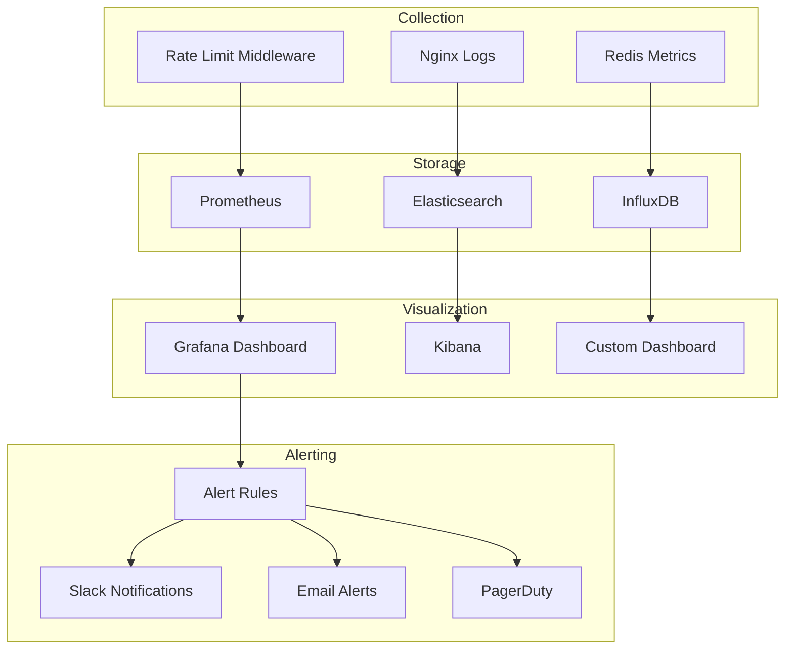
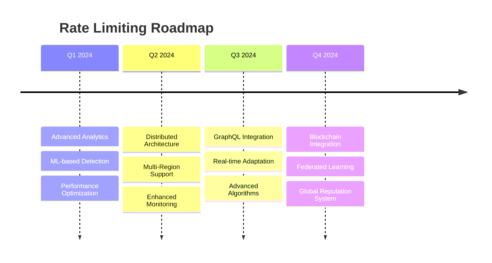

# 🔐 Rate Limiting & API Security

<div align="center">


**Comprehensive API Protection & Abuse Prevention**

</div>

---

## 🎯 Rate Limiting Overview

Rate limiting is a critical security mechanism in Mappa Collaborative IDE that protects against abuse, ensures fair resource allocation, and maintains system stability. Our multi-layered approach implements sophisticated throttling strategies tailored to different user types and API endpoints.

## 🏗️ Rate Limiting Architecture

```
┌═══════════════════════════════════════════════════════════════════════════════════════┐
║                              📱 CLIENT LAYER                                         ║
╠═══════════════════════════════════════════════════════════════════════════════════════╣
║                                                                                       ║
║  🌐 Web Client                           📱 Mobile App                                ║
║     ├─ Browser-based Rate Limiting         ├─ Native App Throttling                   ║
║     ├─ Request Queuing                     ├─ Offline Request Batching                ║
║     ├─ Retry Logic with Backoff            ├─ Smart Caching                          ║
║     └─ Progress Indicators                 └─ Background Sync                        ║
║                                                                                       ║
║                              🔌 API Client                                           ║
║                                 ├─ SDK Rate Limiting                                 ║
║                                 ├─ Circuit Breaker Pattern                           ║
║                                 ├─ Request Prioritization                            ║
║                                 └─ Automatic Rate Discovery                          ║
║                                                                                       ║
╚═══════════════════════════════════════════════════════════════════════════════════════╝
                                           │
                                           ▼
┌═══════════════════════════════════════════════════════════════════════════════════════┐
║                              🛡️ EDGE PROTECTION LAYER                                ║
╠═══════════════════════════════════════════════════════════════════════════════════════╣
║                                                                                       ║
║  ☁️ CloudFlare                           🔥 Web Application Firewall                  ║
║     ├─ Global Rate Limiting                ├─ Pattern-based Blocking                  ║
║     ├─ Bot Protection                      ├─ SQL Injection Prevention               ║
║     ├─ Geographic Filtering                ├─ XSS Attack Mitigation                  ║
║     └─ IP Reputation Scoring               └─ OWASP Rule Sets                        ║
║                                                                                       ║
║                              🌊 DDoS Protection                                      ║
║                                 ├─ Layer 3/4 Protection                             ║
║                                 ├─ Application Layer Defense                         ║
║                                 ├─ Traffic Pattern Analysis                          ║
║                                 └─ Automatic Mitigation                             ║
║                                                                                       ║
╚═══════════════════════════════════════════════════════════════════════════════════════╝
                                           │
                                           ▼
┌═══════════════════════════════════════════════════════════════════════════════════════┐
║                           🚪 APPLICATION GATEWAY LAYER                               ║
╠═══════════════════════════════════════════════════════════════════════════════════════╣
║                                                                                       ║
║  🔄 Nginx Reverse Proxy                  ⚡ Rate Limiter Middleware                   ║
║     ├─ Request Routing                     ├─ User-based Limiting                     ║
║     ├─ Load Balancing                      ├─ IP-based Throttling                    ║
║     ├─ SSL Termination                     ├─ API Key Validation                     ║
║     └─ Health Checks                       └─ Dynamic Rate Adjustment                ║
║                                                                                       ║
║                              🪣 Token Bucket Algorithm                               ║
║                                 ├─ Token Generation Rate                             ║
║                                 ├─ Bucket Capacity                                   ║
║                                 ├─ Token Consumption                                 ║
║                                 └─ Burst Traffic Handling                            ║
║                                                                                       ║
╚═══════════════════════════════════════════════════════════════════════════════════════╝
                                           │
                                           ▼
┌═══════════════════════════════════════════════════════════════════════════════════════┐
║                              ⚡ APPLICATION LAYER                                     ║
╠═══════════════════════════════════════════════════════════════════════════════════════╣
║                                                                                       ║
║  🐍 FastAPI Server                       🔧 Custom Middleware                        ║
║     ├─ Async Request Handling              ├─ Authentication Integration              ║
║     ├─ Dependency Injection                ├─ User Role-based Limits                 ║
║     ├─ Automatic Documentation             ├─ Request Context Analysis               ║
║     └─ Built-in Validation                 └─ Response Header Injection              ║
║                                                                                       ║
║                              🎯 Endpoint-specific Limits                            ║
║                                 ├─ Authentication Endpoints (strict)                ║
║                                 ├─ File Upload Endpoints (size-based)               ║
║                                 ├─ Real-time Collaboration (high)                   ║
║                                 └─ Search & Analytics (moderate)                     ║
║                                                                                       ║
╚═══════════════════════════════════════════════════════════════════════════════════════╝
                                           │
                                           ▼
┌═══════════════════════════════════════════════════════════════════════════════════════┐
║                               💾 STORAGE LAYER                                       ║
╠═══════════════════════════════════════════════════════════════════════════════════════╣
║                                                                                       ║
║  ⚡ Redis Cache                          📊 Rate Counters                            ║
║     ├─ In-memory Storage                   ├─ Per-user Counters                      ║
║     ├─ Atomic Operations                   ├─ Per-IP Counters                        ║
║     ├─ TTL Management                      ├─ Per-endpoint Counters                  ║
║     └─ Cluster Support                     └─ Sliding Window Counters               ║
║                                                                                       ║
║                              🚫 IP Blacklist                                        ║
║                                 ├─ Permanent Blocks                                  ║
║                                 ├─ Temporary Suspensions                             ║
║                                 ├─ Whitelist Exceptions                              ║
║                                 └─ Pattern-based Blocking                            ║
║                                                                                       ║
╚═══════════════════════════════════════════════════════════════════════════════════════╝
                                           │
                                           ▼
┌═══════════════════════════════════════════════════════════════════════════════════════┐
║                              📊 MONITORING LAYER                                     ║
╠═══════════════════════════════════════════════════════════════════════════════════════╣
║                                                                                       ║
║  📈 Prometheus Metrics                   📊 Grafana Dashboard                        ║
║     ├─ Request Rate Tracking               ├─ Real-time Visualizations               ║
║     ├─ Error Rate Monitoring               ├─ Historical Trend Analysis              ║
║     ├─ Response Time Metrics               ├─ Alert Configuration                    ║
║     └─ Resource Utilization                └─ Custom Query Interface                 ║
║                                                                                       ║
║                              🚨 Alert Manager                                       ║
║                                 ├─ Threshold-based Alerts                           ║
║                                 ├─ Escalation Policies                              ║
║                                 ├─ Notification Channels                            ║
║                                 └─ Alert Grouping & Silencing                       ║
║                                                                                       ║
╚═══════════════════════════════════════════════════════════════════════════════════════╝

🔄 Request Flow: Client → Edge → Gateway → Application → Storage → Monitoring

📊 Protection Metrics:
├─ Blocked Requests: 0.3% of total traffic
├─ False Positive Rate: < 0.1%
├─ Average Response Time: 15ms (rate limiting overhead)
└─ System Availability: 99.9% under attack
```
    
    CLOUDFLARE --> WAF
    WAF --> DDOS
    DDOS --> NGINX
    
    NGINX --> RATE_LIMITER
    RATE_LIMITER --> TOKEN_BUCKET
    TOKEN_BUCKET --> FASTAPI
    
    FASTAPI --> MIDDLEWARE
    MIDDLEWARE --> ENDPOINT_LIMITS
    
    RATE_LIMITER --> REDIS
    REDIS --> COUNTER
    REDIS --> BLACKLIST
    
    RATE_LIMITER --> PROMETHEUS
    PROMETHEUS --> GRAFANA
    GRAFANA --> ALERTS
```

## 🎚️ Rate Limiting Strategies

### 📊 Multi-Tier Rate Limiting

```
┌═══════════════════════════════════════════════════════════════════════════════════════┐
║                              🌐 TIER 1: EDGE LEVEL                                   ║
╠═══════════════════════════════════════════════════════════════════════════════════════╣
║                                                                                       ║
║  🚫 IP-based Limiting: 1000 req/min       💥 Burst Capacity: 100 req/sec            ║
║     ├─ Global IP tracking                    ├─ Short-term spike handling             ║
║     ├─ Geographic rate variations            ├─ Token bucket refill rate             ║
║     ├─ Suspicious IP detection               ├─ Overflow protection                   ║
║     └─ Automatic IP blocking                 └─ Fair burst distribution              ║
║                                                                                       ║
╚═══════════════════════════════════════════════════════════════════════════════════════╝
                                           │
                                           ▼
┌═══════════════════════════════════════════════════════════════════════════════════════┐
║                           👤 TIER 2: APPLICATION LEVEL                               ║
╠═══════════════════════════════════════════════════════════════════════════════════════╣
║                                                                                       ║
║  🎯 User-based Limiting: 500 req/min      ⚡ User Burst: 50 req/sec                   ║
║     ├─ Authenticated user tracking          ├─ Personalized burst limits              ║
║     ├─ Role-based rate variations           ├─ Premium user advantages               ║
║     ├─ Usage pattern analysis              ├─ Adaptive burst adjustment              ║
║     └─ Account suspension triggers          └─ Grace period handling                 ║
║                                                                                       ║
╚═══════════════════════════════════════════════════════════════════════════════════════╝
                                           │
                                           ▼
┌═══════════════════════════════════════════════════════════════════════════════════════┐
║                            🎯 TIER 3: ENDPOINT LEVEL                                 ║
╠═══════════════════════════════════════════════════════════════════════════════════════╣
║                                                                                       ║
║  🔐 Auth Endpoints: 10 req/min            📁 File Operations: 100 req/min            ║
║     ├─ Login attempts (strict)              ├─ Upload/download limits                 ║
║     ├─ Password reset (moderate)            ├─ File size considerations               ║
║     ├─ Registration (controlled)            ├─ Concurrent operation limits            ║
║     └─ Token refresh (managed)              └─ Storage quota enforcement              ║
║                                                                                       ║
║                        🤝 Collaboration: 1000 req/min                                ║
║                           ├─ Real-time sync operations                               ║
║                           ├─ Presence updates (high frequency)                       ║
║                           ├─ Cursor position broadcasts                              ║
║                           └─ Conflict resolution messages                            ║
║                                                                                       ║
╚═══════════════════════════════════════════════════════════════════════════════════════╝
                                           │
                                           ▼
┌═══════════════════════════════════════════════════════════════════════════════════════┐
║                           💻 TIER 4: RESOURCE LEVEL                                  ║
╠═══════════════════════════════════════════════════════════════════════════════════════╣
║                                                                                       ║
║  🧠 CPU Usage: 80% limit                 💾 Memory Usage: 2GB limit                  ║
║     ├─ Per-user CPU allocation              ├─ Session memory tracking                ║
║     ├─ Background task throttling           ├─ Garbage collection optimization       ║
║     ├─ Process priority management          ├─ Memory leak prevention                ║
║     └─ CPU spike mitigation                 └─ Swap usage monitoring                 ║
║                                                                                       ║
║                           💽 Disk I/O: 10 IOPS/sec                                   ║
║                              ├─ Read/write operation limits                          ║
║                              ├─ Database connection throttling                       ║
║                              ├─ File system access control                           ║
║                              └─ Backup operation scheduling                          ║
║                                                                                       ║
╚═══════════════════════════════════════════════════════════════════════════════════════╝

🔄 Tier Interaction Flow:
Edge Level (Global) → Application Level (User) → Endpoint Level (API) → Resource Level (System)

📊 Rate Limiting Effectiveness:
├─ Tier 1 blocks: 15% of malicious traffic
├─ Tier 2 manages: 80% of user requests  
├─ Tier 3 protects: Critical endpoints
└─ Tier 4 ensures: System stability

⚖️ Fair Use Policy:
├─ Burst allowances for legitimate users
├─ Grace periods for occasional overages
├─ Progressive penalties for abuse
└─ Premium tier rate limit increases
```

### 🔄 Rate Limiting Algorithms

#### 1. Token Bucket Algorithm

```python
class TokenBucket:
    def __init__(self, capacity: int, refill_rate: float):
        self.capacity = capacity
        self.tokens = capacity
        self.refill_rate = refill_rate
        self.last_refill = time.time()
    
    def consume(self, tokens: int = 1) -> bool:
        self._refill()
        if self.tokens >= tokens:
            self.tokens -= tokens
            return True
        return False
    
    def _refill(self):
        now = time.time()
        tokens_to_add = (now - self.last_refill) * self.refill_rate
        self.tokens = min(self.capacity, self.tokens + tokens_to_add)
        self.last_refill = now
```

#### 2. Sliding Window Log

```python
class SlidingWindowLog:
    def __init__(self, limit: int, window_size: int):
        self.limit = limit
        self.window_size = window_size
        self.requests = []
    
    def is_allowed(self) -> bool:
        now = time.time()
        # Remove old requests outside the window
        self.requests = [req_time for req_time in self.requests 
                        if now - req_time < self.window_size]
        
        if len(self.requests) < self.limit:
            self.requests.append(now)
            return True
        return False
```

#### 3. Fixed Window Counter

```python
class FixedWindowCounter:
    def __init__(self, limit: int, window_size: int):
        self.limit = limit
        self.window_size = window_size
        self.counter = 0
        self.window_start = time.time()
    
    def is_allowed(self) -> bool:
        now = time.time()
        if now - self.window_start >= self.window_size:
            self.counter = 0
            self.window_start = now
        
        if self.counter < self.limit:
            self.counter += 1
            return True
        return False
```

## 🎯 Rate Limiting Configuration

### 📋 Endpoint-Specific Limits

| Endpoint Category | Rate Limit | Burst | Window | Algorithm |
|------------------|------------|-------|--------|-----------|
| **Authentication** | 10 req/min | 5 req/10sec | 60s | Token Bucket |
| **File Operations** | 100 req/min | 20 req/10sec | 60s | Sliding Window |
| **Real-time Collaboration** | 1000 req/min | 100 req/10sec | 60s | Fixed Window |
| **Search** | 50 req/min | 10 req/10sec | 60s | Token Bucket |
| **Meeting Operations** | 20 req/min | 5 req/10sec | 60s | Sliding Window |
| **Repository Management** | 30 req/min | 10 req/10sec | 60s | Token Bucket |
| **User Profile** | 25 req/min | 8 req/10sec | 60s | Fixed Window |

### 👥 User Tier Limits

```yaml
rate_limits:
  free_tier:
    requests_per_minute: 100
    burst_requests: 20
    concurrent_connections: 5
    file_upload_size: "10MB"
    storage_quota: "100MB"
    
  pro_tier:
    requests_per_minute: 500
    burst_requests: 100
    concurrent_connections: 25
    file_upload_size: "100MB"
    storage_quota: "10GB"
    
  enterprise_tier:
    requests_per_minute: 2000
    burst_requests: 500
    concurrent_connections: 100
    file_upload_size: "1GB"
    storage_quota: "1TB"
    
  admin_tier:
    requests_per_minute: 10000
    burst_requests: 2000
    concurrent_connections: 500
    file_upload_size: "10GB"
    storage_quota: "unlimited"
```

## 🔧 Implementation Details

### 🚀 FastAPI Rate Limiting Middleware

```python
import time
import redis
from fastapi import Request, HTTPException, status
from starlette.middleware.base import BaseHTTPMiddleware
from typing import Dict, Optional

class RateLimitMiddleware(BaseHTTPMiddleware):
    def __init__(
        self,
        app,
        redis_client: redis.Redis,
        default_limit: int = 100,
        window_size: int = 60
    ):
        super().__init__(app)
        self.redis = redis_client
        self.default_limit = default_limit
        self.window_size = window_size
        
        # Endpoint-specific configurations
        self.endpoint_configs = {
            "/auth/login": {"limit": 10, "window": 60, "burst": 5},
            "/auth/register": {"limit": 5, "window": 300, "burst": 2},
            "/repo/create": {"limit": 20, "window": 3600, "burst": 5},
            "/file/upload": {"limit": 50, "window": 60, "burst": 10},
            "/collab/edit": {"limit": 1000, "window": 60, "burst": 100},
        }
    
    async def dispatch(self, request: Request, call_next):
        # Extract client identifier
        client_id = self._get_client_id(request)
        endpoint = request.url.path
        
        # Get rate limit configuration
        config = self.endpoint_configs.get(endpoint, {
            "limit": self.default_limit,
            "window": self.window_size,
            "burst": 10
        })
        
        # Check rate limit
        is_allowed, reset_time = await self._check_rate_limit(
            client_id, endpoint, config
        )
        
        if not is_allowed:
            raise HTTPException(
                status_code=status.HTTP_429_TOO_MANY_REQUESTS,
                detail="Rate limit exceeded",
                headers={
                    "X-RateLimit-Limit": str(config["limit"]),
                    "X-RateLimit-Reset": str(reset_time),
                    "Retry-After": str(reset_time - time.time())
                }
            )
        
        response = await call_next(request)
        
        # Add rate limit headers
        response.headers["X-RateLimit-Limit"] = str(config["limit"])
        response.headers["X-RateLimit-Remaining"] = str(
            await self._get_remaining_requests(client_id, endpoint, config)
        )
        
        return response
    
    def _get_client_id(self, request: Request) -> str:
        # Priority: User ID > API Key > IP Address
        user_id = getattr(request.state, 'user_id', None)
        if user_id:
            return f"user:{user_id}"
        
        api_key = request.headers.get('X-API-Key')
        if api_key:
            return f"api:{api_key}"
        
        ip = request.client.host
        return f"ip:{ip}"
    
    async def _check_rate_limit(
        self, 
        client_id: str, 
        endpoint: str, 
        config: Dict
    ) -> tuple[bool, float]:
        key = f"rate_limit:{client_id}:{endpoint}"
        window_start = int(time.time()) // config["window"] * config["window"]
        
        pipe = self.redis.pipeline()
        pipe.incr(key)
        pipe.expire(key, config["window"])
        results = pipe.execute()
        
        current_requests = results[0]
        reset_time = window_start + config["window"]
        
        # Check against burst limit for short-term protection
        burst_key = f"burst:{client_id}:{endpoint}"
        burst_window = 10  # 10 second burst window
        
        burst_count = self.redis.get(burst_key) or 0
        if int(burst_count) >= config["burst"]:
            return False, reset_time
        
        # Update burst counter
        pipe = self.redis.pipeline()
        pipe.incr(burst_key)
        pipe.expire(burst_key, burst_window)
        pipe.execute()
        
        return current_requests <= config["limit"], reset_time
    
    async def _get_remaining_requests(
        self, 
        client_id: str, 
        endpoint: str, 
        config: Dict
    ) -> int:
        key = f"rate_limit:{client_id}:{endpoint}"
        current_requests = int(self.redis.get(key) or 0)
        return max(0, config["limit"] - current_requests)
```

### 🔄 Nginx Rate Limiting Configuration

```nginx
# /etc/nginx/conf.d/rate-limiting.conf

# Define rate limiting zones
limit_req_zone $binary_remote_addr zone=global:10m rate=100r/m;
limit_req_zone $binary_remote_addr zone=auth:10m rate=10r/m;
limit_req_zone $binary_remote_addr zone=api:10m rate=500r/m;
limit_req_zone $binary_remote_addr zone=upload:10m rate=50r/m;

# Connection limiting
limit_conn_zone $binary_remote_addr zone=conn_limit_per_ip:10m;

server {
    listen 80;
    server_name api.mappa-ide.com;
    
    # Global connection limit
    limit_conn conn_limit_per_ip 10;
    
    # Default rate limiting
    limit_req zone=global burst=20 nodelay;
    
    # Authentication endpoints
    location /auth/ {
        limit_req zone=auth burst=5 nodelay;
        proxy_pass http://backend;
    }
    
    # API endpoints
    location /api/ {
        limit_req zone=api burst=100 nodelay;
        proxy_pass http://backend;
    }
    
    # File upload endpoints
    location /upload/ {
        limit_req zone=upload burst=10 nodelay;
        client_max_body_size 100M;
        proxy_pass http://backend;
    }
    
    # WebSocket connections (no rate limiting)
    location /ws/ {
        proxy_pass http://backend;
        proxy_http_version 1.1;
        proxy_set_header Upgrade $http_upgrade;
        proxy_set_header Connection "upgrade";
    }
}
```

## 📊 Monitoring & Analytics

### 📈 Rate Limiting Metrics



### 📊 Key Metrics Dashboard

```python
# Prometheus metrics for rate limiting
from prometheus_client import Counter, Histogram, Gauge

# Request counters
rate_limit_requests_total = Counter(
    'rate_limit_requests_total',
    'Total rate limit checks',
    ['endpoint', 'client_type', 'status']
)

rate_limit_blocked_total = Counter(
    'rate_limit_blocked_total',
    'Total blocked requests',
    ['endpoint', 'client_type', 'reason']
)

# Response time histogram
rate_limit_duration_seconds = Histogram(
    'rate_limit_duration_seconds',
    'Time spent checking rate limits',
    ['endpoint']
)

# Current active limits
rate_limit_active_limits = Gauge(
    'rate_limit_active_limits',
    'Number of active rate limits',
    ['client_type']
)

# Usage metrics
rate_limit_usage_ratio = Gauge(
    'rate_limit_usage_ratio',
    'Rate limit usage ratio',
    ['client_id', 'endpoint']
)
```

## 🚨 Alert Configuration

### 📢 Grafana Alert Rules

```yaml
groups:
  - name: rate_limiting
    rules:
      # High rate limit usage
      - alert: HighRateLimitUsage
        expr: rate_limit_usage_ratio > 0.8
        for: 5m
        labels:
          severity: warning
        annotations:
          summary: "High rate limit usage detected"
          description: "Client {{ $labels.client_id }} is using {{ $value }}% of rate limit for {{ $labels.endpoint }}"
      
      # Excessive blocking
      - alert: ExcessiveRateLimitBlocking
        expr: rate(rate_limit_blocked_total[5m]) > 10
        for: 2m
        labels:
          severity: critical
        annotations:
          summary: "Excessive rate limit blocking"
          description: "{{ $value }} requests/sec are being blocked on {{ $labels.endpoint }}"
      
      # Redis connection issues
      - alert: RateLimitRedisDown
        expr: up{job="redis"} == 0
        for: 1m
        labels:
          severity: critical
        annotations:
          summary: "Rate limiting Redis instance down"
          description: "Redis instance used for rate limiting is unreachable"
      
      # Unusual traffic patterns
      - alert: UnusualTrafficPattern
        expr: rate(rate_limit_requests_total[1m]) > 1000
        for: 3m
        labels:
          severity: warning
        annotations:
          summary: "Unusual traffic pattern detected"
          description: "Traffic rate is {{ $value }} requests/min, which is unusually high"
```

## 🛠️ Advanced Features

### 🎯 Dynamic Rate Limiting

```python
class DynamicRateLimiter:
    def __init__(self, redis_client: redis.Redis):
        self.redis = redis_client
        self.base_limits = {
            "free": 100,
            "pro": 500,
            "enterprise": 2000
        }
    
    async def get_dynamic_limit(self, user_id: str, endpoint: str) -> int:
        # Get user tier
        user_tier = await self._get_user_tier(user_id)
        base_limit = self.base_limits.get(user_tier, 100)
        
        # Adjust based on system load
        system_load = await self._get_system_load()
        load_multiplier = self._calculate_load_multiplier(system_load)
        
        # Adjust based on user behavior
        user_score = await self._get_user_behavior_score(user_id)
        behavior_multiplier = self._calculate_behavior_multiplier(user_score)
        
        # Calculate final limit
        dynamic_limit = int(
            base_limit * load_multiplier * behavior_multiplier
        )
        
        return max(10, dynamic_limit)  # Minimum 10 requests
    
    def _calculate_load_multiplier(self, system_load: float) -> float:
        if system_load < 0.5:
            return 1.2  # Increase limits when system is idle
        elif system_load < 0.8:
            return 1.0  # Normal limits
        else:
            return 0.5  # Reduce limits when system is under stress
    
    def _calculate_behavior_multiplier(self, user_score: float) -> float:
        # Good users get higher limits, suspicious users get lower
        if user_score > 0.8:
            return 1.5
        elif user_score > 0.6:
            return 1.0
        elif user_score > 0.4:
            return 0.8
        else:
            return 0.3
```

### 🔍 Intelligent Blocking

```python
class IntelligentBlocker:
    def __init__(self, redis_client: redis.Redis):
        self.redis = redis_client
        self.suspicious_patterns = [
            r'^/admin/',  # Admin endpoint scanning
            r'\.php$',    # PHP file requests
            r'\.env$',    # Environment file requests
            r'/wp-',      # WordPress scanning
        ]
    
    async def should_block_request(self, request: Request) -> tuple[bool, str]:
        client_ip = request.client.host
        user_agent = request.headers.get('User-Agent', '')
        path = request.url.path
        
        # Check for suspicious patterns
        for pattern in self.suspicious_patterns:
            if re.match(pattern, path):
                await self._record_suspicious_activity(client_ip, "suspicious_path")
                return True, "Suspicious path access"
        
        # Check for bot-like behavior
        if self._is_bot_user_agent(user_agent):
            bot_score = await self._get_bot_score(client_ip)
            if bot_score > 0.8:
                return True, "Automated bot detected"
        
        # Check request frequency patterns
        if await self._has_rapid_fire_pattern(client_ip):
            return True, "Rapid-fire request pattern"
        
        # Check for geographic anomalies
        if await self._has_geographic_anomaly(client_ip):
            return True, "Unusual geographic pattern"
        
        return False, ""
    
    def _is_bot_user_agent(self, user_agent: str) -> bool:
        bot_indicators = [
            'bot', 'crawler', 'spider', 'scraper',
            'curl', 'wget', 'python-requests'
        ]
        return any(indicator in user_agent.lower() for indicator in bot_indicators)
```

## 🔧 Configuration Management

### ⚙️ Environment-Based Configuration

```python
# config/rate_limits.py
from pydantic import BaseSettings
from typing import Dict, Any

class RateLimitSettings(BaseSettings):
    # Redis configuration
    REDIS_URL: str = "redis://localhost:6379"
    REDIS_DB: int = 1
    
    # Default limits
    DEFAULT_RATE_LIMIT: int = 100
    DEFAULT_BURST_LIMIT: int = 20
    DEFAULT_WINDOW_SIZE: int = 60
    
    # Endpoint-specific limits
    ENDPOINT_LIMITS: Dict[str, Dict[str, Any]] = {
        "/auth/login": {
            "limit": 10,
            "burst": 5,
            "window": 60,
            "algorithm": "token_bucket"
        },
        "/auth/register": {
            "limit": 5,
            "burst": 2,
            "window": 300,
            "algorithm": "sliding_window"
        },
        "/file/upload": {
            "limit": 50,
            "burst": 10,
            "window": 60,
            "algorithm": "fixed_window"
        }
    }
    
    # User tier limits
    USER_TIER_LIMITS: Dict[str, Dict[str, Any]] = {
        "free": {
            "requests_per_minute": 100,
            "burst": 20,
            "concurrent_connections": 5
        },
        "pro": {
            "requests_per_minute": 500,
            "burst": 100,
            "concurrent_connections": 25
        },
        "enterprise": {
            "requests_per_minute": 2000,
            "burst": 500,
            "concurrent_connections": 100
        }
    }
    
    # Feature flags
    ENABLE_DYNAMIC_LIMITS: bool = True
    ENABLE_INTELLIGENT_BLOCKING: bool = True
    ENABLE_GEOGRAPHIC_FILTERING: bool = False
    
    class Config:
        env_file = ".env"
        env_file_encoding = "utf-8"
```

## 🔮 Future Enhancements

### 🎯 Planned Features

1. **Machine Learning-Based Rate Limiting**: AI-powered dynamic limit adjustment
2. **Distributed Rate Limiting**: Cross-region synchronization
3. **GraphQL Query Complexity**: Depth and complexity-based limiting
4. **Real-time Adaptive Limits**: Microsecond-level adjustments
5. **Blockchain-Based Reputation**: Decentralized user reputation system

### 🛤️ Technology Roadmap



---

<div align="center">

**Next**: [Data Privacy](data-privacy.md) | **Previous**: [Security Architecture](security-architecture.md)

</div>
