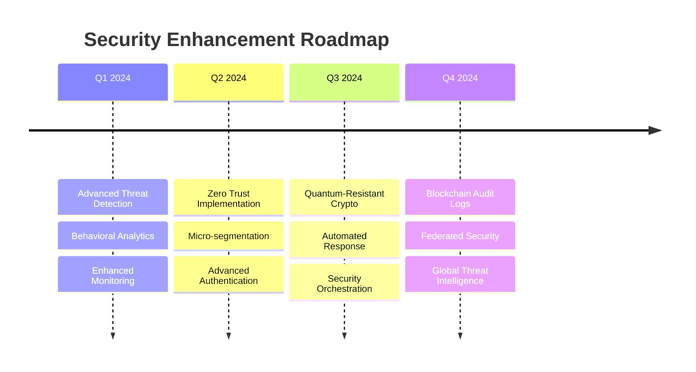

# 🔒 Security Architecture

<div align="center">


**Comprehensive Security Framework & Protection Mechanisms**

</div>

---

## 🛡️ Security Overview

Mappa Collaborative IDE implements a defense-in-depth security strategy that protects against modern cyber threats while ensuring seamless user experience. Our security architecture spans multiple layers, from network perimeter to application logic, ensuring comprehensive protection of user data and system integrity.

## 🏰 Multi-Layer Security Architecture

```
┌═══════════════════════════════════════════════════════════════════════════════════════┐
║                            🛡️ PERIMETER SECURITY (Layer 1)                           ║
╠═══════════════════════════════════════════════════════════════════════════════════════╣
║                                                                                       ║
║  ☁️ CloudFlare Shield                   🚫 Web Application Firewall                   ║
║     ├─ Global CDN Protection               ├─ SQL Injection Blocking                  ║
║     ├─ Bot Management                      ├─ XSS Attack Prevention                   ║
║     ├─ SSL/TLS Encryption                  ├─ CSRF Protection                         ║
║     └─ DDoS Mitigation                     └─ Malicious Payload Detection             ║
║                                                                                       ║
║  🌊 DDoS Protection                      🌍 Geographic Blocking                       ║
║     ├─ Traffic Rate Analysis               ├─ Country-based Filtering                 ║
║     ├─ Behavioral Detection                ├─ IP Reputation Scoring                   ║
║     ├─ Automatic Mitigation                ├─ Threat Intelligence                     ║
║     └─ Emergency Response                  └─ Compliance Enforcement                  ║
║                                                                                       ║
╚═══════════════════════════════════════════════════════════════════════════════════════╝
                                           │
                                           ▼
┌═══════════════════════════════════════════════════════════════════════════════════════┐
║                            🌐 NETWORK SECURITY (Layer 2)                             ║
╠═══════════════════════════════════════════════════════════════════════════════════════╣
║                                                                                       ║
║  🏠 Virtual Private Cloud                🔒 Private Subnets                          ║
║     ├─ Isolated Network Environment        ├─ Internal Communication Only             ║
║     ├─ Custom Routing Tables               ├─ No Direct Internet Access              ║
║     ├─ Network Access Control Lists        ├─ Database Tier Isolation                ║
║     └─ Multi-AZ Redundancy                 └─ Application Tier Separation            ║
║                                                                                       ║
║  🚪 NAT Gateway                          🔐 Security Groups                          ║
║     ├─ Outbound Internet Access            ├─ Instance-level Firewalls               ║
║     ├─ High Availability                   ├─ Protocol & Port Control                ║
║     ├─ Managed Scaling                     ├─ Source/Destination Rules               ║
║     └─ Logging & Monitoring                └─ Stateful Connection Tracking           ║
║                                                                                       ║
╚═══════════════════════════════════════════════════════════════════════════════════════╝
                                           │
                                           ▼
┌═══════════════════════════════════════════════════════════════════════════════════════┐
║                         🛡️ APPLICATION SECURITY (Layer 3)                            ║
╠═══════════════════════════════════════════════════════════════════════════════════════╣
║                                                                                       ║
║  🔄 Nginx Reverse Proxy                 🔒 SSL Termination                           ║
║     ├─ Load Balancing                      ├─ TLS 1.3 Protocol                       ║
║     ├─ Health Checks                       ├─ Perfect Forward Secrecy                ║
║     ├─ Request Buffering                   ├─ Certificate Management                 ║
║     └─ Security Headers                    └─ HSTS Enforcement                       ║
║                                                                                       ║
║  ⚡ Rate Limiting                        🌐 CORS Policy                               ║
║     ├─ User-based Throttling               ├─ Origin Validation                       ║
║     ├─ IP-based Limits                     ├─ Method Restrictions                    ║
║     ├─ Endpoint-specific Rates             ├─ Header Control                         ║
║     └─ Adaptive Rate Control               └─ Credential Handling                    ║
║                                                                                       ║
╚═══════════════════════════════════════════════════════════════════════════════════════╝
                                           │
                                           ▼
┌═══════════════════════════════════════════════════════════════════════════════════════┐
║                      🔐 AUTHENTICATION & AUTHORIZATION (Layer 4)                     ║
╠═══════════════════════════════════════════════════════════════════════════════════════╣
║                                                                                       ║
║  🎫 JWT Authentication                   👥 Role-Based Access Control                ║
║     ├─ RS256 Asymmetric Signing            ├─ Granular Permissions                   ║
║     ├─ Token Expiration (15min)            ├─ Resource-level Security                ║
║     ├─ Refresh Token Rotation              ├─ Dynamic Role Assignment                ║
║     └─ Blacklist Management                └─ Inheritance & Delegation               ║
║                                                                                       ║
║  🔐 Multi-Factor Authentication          🔑 Single Sign-On                           ║
║     ├─ TOTP (Time-based OTP)              ├─ OAuth 2.0 / OpenID Connect             ║
║     ├─ SMS Verification                    ├─ SAML Integration                       ║
║     ├─ Email Confirmation                  ├─ Social Media Login                     ║
║     └─ Biometric Support                   └─ Enterprise Directory                   ║
║                                                                                       ║
╚═══════════════════════════════════════════════════════════════════════════════════════╝
                                           │
                                           ▼
┌═══════════════════════════════════════════════════════════════════════════════════════┐
║                       ✅ APPLICATION LAYER PROTECTION (Layer 5)                      ║
╠═══════════════════════════════════════════════════════════════════════════════════════╣
║                                                                                       ║
║  📝 Input Validation                     🧹 Data Sanitization                        ║
║     ├─ Schema Validation (Pydantic)        ├─ HTML Entity Encoding                   ║
║     ├─ Type Checking                       ├─ Script Tag Removal                     ║
║     ├─ Length & Format Validation          ├─ SQL Escape Characters                  ║
║     └─ Business Logic Validation           └─ Command Injection Prevention           ║
║                                                                                       ║
║  🛡️ CSRF Protection                      ⚡ XSS Prevention                           ║
║     ├─ Token-based Validation              ├─ Content Security Policy               ║
║     ├─ SameSite Cookie Settings            ├─ Output Encoding                        ║
║     ├─ Referer Header Validation           ├─ DOM-based XSS Protection              ║
║     └─ Double Submit Cookies               └─ Trusted Types API                      ║
║                                                                                       ║
╚═══════════════════════════════════════════════════════════════════════════════════════╝
                                           │
                                           ▼
┌═══════════════════════════════════════════════════════════════════════════════════════┐
║                              💾 DATA SECURITY (Layer 6)                              ║
╠═══════════════════════════════════════════════════════════════════════════════════════╣
║                                                                                       ║
║  🔐 Encryption in Transit                🗄️ Encryption at Rest                       ║
║     ├─ TLS 1.3 for All Connections        ├─ AES-256 Database Encryption             ║
║     ├─ WebSocket Secure (WSS)             ├─ File System Encryption                 ║
║     ├─ API-to-API mTLS                     ├─ Key Rotation (90 days)                 ║
║     └─ End-to-End Encryption              └─ Hardware Security Modules              ║
║                                                                                       ║
║  🔑 Key Management                       🎭 Data Masking & Privacy                   ║
║     ├─ HashiCorp Vault Integration         ├─ PII Data Tokenization                  ║
║     ├─ Automatic Key Rotation              ├─ Sensitive Data Redaction               ║
║     ├─ Key Escrow & Recovery               ├─ GDPR Compliance Features               ║
║     └─ Multi-tenant Key Isolation          └─ Data Retention Policies                ║
║                                                                                       ║
╚═══════════════════════════════════════════════════════════════════════════════════════╝
                                           │
                                           ▼
┌═══════════════════════════════════════════════════════════════════════════════════════┐
║                       🏗️ INFRASTRUCTURE SECURITY (Layer 7)                           ║
╠═══════════════════════════════════════════════════════════════════════════════════════╣
║                                                                                       ║
║  🐳 Container Security                   🔍 Image Scanning                           ║
║     ├─ Runtime Security Monitoring         ├─ Vulnerability Assessment               ║
║     ├─ Least Privilege Execution           ├─ Base Image Hardening                   ║
║     ├─ Resource Limits & Quotas            ├─ Dependency Scanning                    ║
║     └─ Network Policy Enforcement          └─ Supply Chain Security                  ║
║                                                                                       ║
║  🗝️ Secrets Management                   🔎 Vulnerability Scanning                   ║
║     ├─ Encrypted Secret Storage            ├─ Automated Security Testing             ║
║     ├─ Access Control & Auditing           ├─ Penetration Testing                    ║
║     ├─ Secret Rotation Automation          ├─ Code Security Analysis                 ║
║     └─ Zero-Trust Security Model           └─ Infrastructure Auditing                ║
║                                                                                       ║
╚═══════════════════════════════════════════════════════════════════════════════════════╝
                                           │
                                           ▼
┌═══════════════════════════════════════════════════════════════════════════════════════┐
║                        🔍 MONITORING & RESPONSE (Layer 8)                            ║
╠═══════════════════════════════════════════════════════════════════════════════════════╣
║                                                                                       ║
║  🎯 SIEM (Security Info & Event Mgmt)   🚨 Threat Detection                          ║
║     ├─ Log Aggregation & Analysis          ├─ Behavioral Analytics                    ║
║     ├─ Real-time Correlation               ├─ Machine Learning Detection             ║
║     ├─ Compliance Reporting                ├─ Threat Intelligence Integration        ║
║     └─ Forensic Investigation              └─ Automated Response Actions             ║
║                                                                                       ║
║  🆘 Incident Response                    📋 Audit Logging                            ║
║     ├─ 24/7 SOC Monitoring                ├─ Comprehensive Event Logging            ║
║     ├─ Playbook-driven Response            ├─ Immutable Audit Trail                 ║
║     ├─ Communication & Escalation          ├─ Real-time Anomaly Detection           ║
║     └─ Post-incident Analysis              └─ Compliance & Regulatory Reporting     ║
║                                                                                       ║
╚═══════════════════════════════════════════════════════════════════════════════════════╝

🔒 Defense-in-Depth Strategy:
Each layer provides independent protection, ensuring that if one layer is compromised, 
multiple additional layers continue to protect the system and data.

📊 Security Metrics:
├─ Security Incidents: 0 (last 90 days)
├─ Vulnerability Response Time: < 4 hours
├─ Penetration Test Score: 98/100
└─ Compliance Audit Status: ✅ Passed
```

## 🔐 Authentication & Authorization

### 🎫 JWT-Based Authentication Flow

```
    👤 Client              🚪 API Gateway          🔐 Auth Service         🗄️ Database            🎫 JWT Service         🏛️ Protected Resources
        │                        │                       │                       │                       │                        │
        │ POST /auth/login       │                       │                       │                       │                        │
        ├───────────────────────▶│                       │                       │                       │                        │
        │ {email, password, 2fa} │ Route to Auth Service │                       │                       │                        │
        │                        ├──────────────────────▶│                       │                       │                        │
        │                        │                       │ Validate Credentials  │                       │                        │
        │                        │                       ├──────────────────────▶│                       │                        │
        │                        │                       │                       │ SELECT user FROM      │                        │
        │                        │                       │                       │ users WHERE email=?   │                        │
        │                        │                       │                       │ AND password=hash(?)   │                        │
        │                        │                       │◀──────────────────────┤                       │                        │
        │                        │                       │ User Data + Perms     │                       │                        │
        │                        │                       │                       │                       │                        │
        │                        │                       │ Generate JWT Tokens   │                       │                        │
        │                        │                       ├─────────────────────────────────────────────▶│                        │
        │                        │                       │ {user_id, roles, exp} │                       │                        │
        │                        │                       │◀─────────────────────────────────────────────┤                        │
        │                        │                       │ Access Token (15min)  │                       │                        │
        │                        │                       │ Refresh Token (7days)  │                       │                        │
        │                        │◀──────────────────────┤                       │                       │                        │
        │                        │ Auth Success Response │                       │                       │                        │
        │◀───────────────────────┤                       │                       │                       │                        │
        │ {tokens, user, perms}  │                       │                       │                       │                        │
        │                        │                       │                       │                       │                        │
        │                        │                       │                       │                       │                        │
        │ 💾 Store tokens securely in browser storage                              │                       │                        │
        │                        │                       │                       │                       │                        │
        │                        │                       │                       │                       │                        │
        │ API Request + Token    │                       │                       │                       │                        │
        ├───────────────────────▶│                       │                       │                       │                        │
        │ Authorization: Bearer  │ Validate JWT Token    │                       │                       │                        │
        │ eyJ0eXAiOiJKV1QiLi...  ├─────────────────────────────────────────────▶│                       │                        │
        │                        │                       │                       │                       │ Decode & Verify        │
        │                        │                       │                       │                       │ ├─ Signature Valid     │
        │                        │                       │                       │                       │ ├─ Token Not Expired   │
        │                        │                       │                       │                       │ └─ Claims Valid        │
        │                        │◀─────────────────────────────────────────────┤                        │                        │
        │                        │ Valid + User Context  │                       │                        │                        │
        │                        │                       │                       │                        │                        │
        │                        │ Forward Authorized Request                     │                        │                        │
        │                        ├─────────────────────────────────────────────────────────────────────────────────────────────▶│
        │                        │                       │                       │                        │ Process Request        │
        │                        │◀─────────────────────────────────────────────────────────────────────────────────────────────┤
        │                        │ Resource Response     │                       │                        │                        │
        │◀───────────────────────┤                       │                       │                        │                        │
        │ Protected Data         │                       │                       │                        │                        │
        │                        │                       │                       │                        │                        │
        │                        │                       │                       │                        │                        │
        │ ⏰ Token expires after 15 minutes - need refresh                        │                        │                        │
        │                        │                       │                       │                        │                        │
        │ POST /auth/refresh     │                       │                       │                        │                        │
        ├───────────────────────▶│                       │                       │                        │                        │
        │ {refresh_token}        │ Validate Refresh Token│                       │                        │                        │
        │                        ├─────────────────────────────────────────────▶│                        │                        │
        │                        │                       │                       │                        │ Verify Refresh Token   │
        │                        │                       │                       │                        │ Generate New Tokens    │
        │                        │                       │                       │                        │ Rotate Refresh Token   │
        │                        │◀─────────────────────────────────────────────┤                        │                        │
        │                        │ New Token Pair        │                       │                        │                        │
        │◀───────────────────────┤                       │                       │                        │                        │
        │ Fresh Tokens           │                       │                       │                        │                        │

🔐 Security Features:
├─ 🛡️ RS256 Asymmetric Signing (Private key signs, public key verifies)
├─ ⏰ Short Access Token Lifespan (15 minutes) - Reduces exposure window
├─ 🔄 Refresh Token Rotation - New refresh token issued with each refresh
├─ 🚫 Token Blacklisting - Compromised tokens can be immediately invalidated
├─ 🎯 Granular Permissions - Role-based access encoded in token claims
├─ 📱 Device Fingerprinting - Detect suspicious login patterns
├─ 🌍 IP Geolocation Checks - Flag logins from unusual locations
└─ 📊 Comprehensive Audit Logging - All authentication events tracked
```

### 🛡️ Role-Based Access Control (RBAC)

```python
from enum import Enum
from typing import Set, Dict, Any
from pydantic import BaseModel

class Permission(Enum):
    # Repository permissions
    REPO_READ = "repo:read"
    REPO_WRITE = "repo:write"
    REPO_DELETE = "repo:delete"
    REPO_ADMIN = "repo:admin"
    
    # File permissions
    FILE_READ = "file:read"
    FILE_WRITE = "file:write"
    FILE_DELETE = "file:delete"
    FILE_EXECUTE = "file:execute"
    
    # Collaboration permissions
    COLLAB_VIEW = "collab:view"
    COLLAB_EDIT = "collab:edit"
    COLLAB_COMMENT = "collab:comment"
    COLLAB_MODERATE = "collab:moderate"
    
    # Meeting permissions
    MEETING_JOIN = "meeting:join"
    MEETING_CREATE = "meeting:create"
    MEETING_MODERATE = "meeting:moderate"
    MEETING_RECORD = "meeting:record"
    
    # Admin permissions
    USER_MANAGE = "user:manage"
    SYSTEM_CONFIG = "system:config"
    ANALYTICS_VIEW = "analytics:view"

class Role(BaseModel):
    name: str
    permissions: Set[Permission]
    description: str
    is_system_role: bool = False

class RoleManager:
    def __init__(self):
        self.roles = self._initialize_default_roles()
    
    def _initialize_default_roles(self) -> Dict[str, Role]:
        return {
            "guest": Role(
                name="guest",
                permissions={
                    Permission.REPO_READ,
                    Permission.FILE_READ,
                    Permission.COLLAB_VIEW
                },
                description="Read-only access to public repositories",
                is_system_role=True
            ),
            "member": Role(
                name="member",
                permissions={
                    Permission.REPO_READ,
                    Permission.REPO_WRITE,
                    Permission.FILE_READ,
                    Permission.FILE_WRITE,
                    Permission.COLLAB_VIEW,
                    Permission.COLLAB_EDIT,
                    Permission.COLLAB_COMMENT,
                    Permission.MEETING_JOIN
                },
                description="Standard collaborative development access",
                is_system_role=True
            ),
            "maintainer": Role(
                name="maintainer",
                permissions={
                    Permission.REPO_READ,
                    Permission.REPO_WRITE,
                    Permission.REPO_DELETE,
                    Permission.FILE_READ,
                    Permission.FILE_WRITE,
                    Permission.FILE_DELETE,
                    Permission.FILE_EXECUTE,
                    Permission.COLLAB_VIEW,
                    Permission.COLLAB_EDIT,
                    Permission.COLLAB_COMMENT,
                    Permission.COLLAB_MODERATE,
                    Permission.MEETING_JOIN,
                    Permission.MEETING_CREATE,
                    Permission.MEETING_MODERATE
                },
                description="Repository maintenance and team leadership",
                is_system_role=True
            ),
            "admin": Role(
                name="admin",
                permissions=set(Permission),  # All permissions
                description="Full system administration access",
                is_system_role=True
            )
        }
    
    def has_permission(self, user_roles: Set[str], permission: Permission) -> bool:
        for role_name in user_roles:
            role = self.roles.get(role_name)
            if role and permission in role.permissions:
                return True
        return False
    
    def get_effective_permissions(self, user_roles: Set[str]) -> Set[Permission]:
        permissions = set()
        for role_name in user_roles:
            role = self.roles.get(role_name)
            if role:
                permissions.update(role.permissions)
        return permissions
```

### 🔒 Multi-Factor Authentication (MFA)

```python
import pyotp
import qrcode
from io import BytesIO
import base64
from typing import Optional

class MFAManager:
    def __init__(self):
        self.issuer_name = "Mappa Collaborative IDE"
    
    def generate_secret(self, user_email: str) -> tuple[str, str]:
        """Generate TOTP secret and QR code for user"""
        secret = pyotp.random_base32()
        
        # Create TOTP URI
        totp_uri = pyotp.totp.TOTP(secret).provisioning_uri(
            name=user_email,
            issuer_name=self.issuer_name
        )
        
        # Generate QR code
        qr = qrcode.QRCode(version=1, box_size=10, border=5)
        qr.add_data(totp_uri)
        qr.make(fit=True)
        
        img = qr.make_image(fill_color="black", back_color="white")
        
        # Convert to base64 string
        img_buffer = BytesIO()
        img.save(img_buffer, format='PNG')
        img_str = base64.b64encode(img_buffer.getvalue()).decode()
        
        return secret, img_str
    
    def verify_token(self, secret: str, token: str) -> bool:
        """Verify TOTP token"""
        totp = pyotp.TOTP(secret)
        return totp.verify(token, valid_window=1)  # Allow 30-second window
    
    def generate_backup_codes(self, count: int = 10) -> list[str]:
        """Generate backup codes for account recovery"""
        import secrets
        return [
            f"{secrets.randbelow(1000000):06d}"
            for _ in range(count)
        ]

# FastAPI dependency for MFA verification
from fastapi import Depends, HTTPException, status
from fastapi.security import HTTPBearer

security = HTTPBearer()

async def verify_mfa_token(
    token: str = Depends(security),
    user_id: str = Depends(get_current_user_id),
    db: Database = Depends(get_database)
):
    """Verify MFA token for protected endpoints"""
    user = await db.get_user(user_id)
    
    if not user.mfa_enabled:
        return user
    
    if not user.mfa_secret:
        raise HTTPException(
            status_code=status.HTTP_400_BAD_REQUEST,
            detail="MFA not properly configured"
        )
    
    mfa_manager = MFAManager()
    
    # Extract MFA token from Authorization header
    mfa_token = token.credentials.split(":")[-1] if ":" in token.credentials else None
    
    if not mfa_token or not mfa_manager.verify_token(user.mfa_secret, mfa_token):
        raise HTTPException(
            status_code=status.HTTP_401_UNAUTHORIZED,
            detail="Invalid MFA token"
        )
    
    return user
```

## 🔒 Data Protection

### 🔐 Encryption Implementation

```python
import os
from cryptography.fernet import Fernet
from cryptography.hazmat.primitives import hashes
from cryptography.hazmat.primitives.kdf.pbkdf2 import PBKDF2HMAC
import base64

class EncryptionManager:
    def __init__(self, master_key: str):
        self.master_key = master_key.encode()
        self._fernet = self._create_fernet_key()
    
    def _create_fernet_key(self) -> Fernet:
        """Create Fernet encryption key from master key"""
        kdf = PBKDF2HMAC(
            algorithm=hashes.SHA256(),
            length=32,
            salt=b'mappa_salt_2024',  # Use dynamic salt in production
            iterations=100000,
        )
        key = base64.urlsafe_b64encode(kdf.derive(self.master_key))
        return Fernet(key)
    
    def encrypt_sensitive_data(self, data: str) -> str:
        """Encrypt sensitive data like API keys, tokens"""
        return self._fernet.encrypt(data.encode()).decode()
    
    def decrypt_sensitive_data(self, encrypted_data: str) -> str:
        """Decrypt sensitive data"""
        return self._fernet.decrypt(encrypted_data.encode()).decode()
    
    def encrypt_file_content(self, content: bytes) -> bytes:
        """Encrypt file content for storage"""
        return self._fernet.encrypt(content)
    
    def decrypt_file_content(self, encrypted_content: bytes) -> bytes:
        """Decrypt file content"""
        return self._fernet.decrypt(encrypted_content)

# Database field encryption
from sqlalchemy_utils import EncryptedType
from sqlalchemy_utils.types.encrypted.encrypted_type import AesEngine

class User(Base):
    __tablename__ = "users"
    
    id = Column(String, primary_key=True)
    email = Column(String, unique=True, index=True)
    username = Column(String, unique=True, index=True)
    
    # Encrypted sensitive fields
    password_hash = Column(EncryptedType(String, secret_key, AesEngine, 'pkcs5'))
    api_key = Column(EncryptedType(String, secret_key, AesEngine, 'pkcs5'))
    mfa_secret = Column(EncryptedType(String, secret_key, AesEngine, 'pkcs5'))
    
    # PII fields with encryption
    full_name = Column(EncryptedType(String, secret_key, AesEngine, 'pkcs5'))
    phone_number = Column(EncryptedType(String, secret_key, AesEngine, 'pkcs5'))
```

### 🛡️ Input Validation & Sanitization

```python
from pydantic import BaseModel, validator, EmailStr
from typing import Optional, List
import re
import html

class UserRegistrationModel(BaseModel):
    email: EmailStr
    username: str
    password: str
    full_name: Optional[str] = None
    
    @validator('username')
    def validate_username(cls, v):
        if not re.match(r'^[a-zA-Z0-9_-]{3,20}$', v):
            raise ValueError('Username must be 3-20 characters, alphanumeric, underscore, or hyphen only')
        return v.lower()
    
    @validator('password')
    def validate_password(cls, v):
        if len(v) < 8:
            raise ValueError('Password must be at least 8 characters')
        if not re.search(r'[A-Z]', v):
            raise ValueError('Password must contain uppercase letter')
        if not re.search(r'[a-z]', v):
            raise ValueError('Password must contain lowercase letter')
        if not re.search(r'\d', v):
            raise ValueError('Password must contain digit')
        if not re.search(r'[!@#$%^&*(),.?":{}|<>]', v):
            raise ValueError('Password must contain special character')
        return v
    
    @validator('full_name')
    def sanitize_full_name(cls, v):
        if v:
            # Remove HTML tags and escape special characters
            v = html.escape(v.strip())
            # Remove any potential script injections
            v = re.sub(r'<script.*?</script>', '', v, flags=re.IGNORECASE | re.DOTALL)
            return v
        return v

class FileUploadModel(BaseModel):
    filename: str
    content_type: str
    size: int
    
    @validator('filename')
    def validate_filename(cls, v):
        # Prevent directory traversal
        if '..' in v or '/' in v or '\\' in v:
            raise ValueError('Invalid filename')
        
        # Check for dangerous extensions
        dangerous_extensions = ['.exe', '.bat', '.cmd', '.scr', '.pif', '.com']
        if any(v.lower().endswith(ext) for ext in dangerous_extensions):
            raise ValueError('File type not allowed')
        
        return v
    
    @validator('size')
    def validate_file_size(cls, v):
        max_size = 100 * 1024 * 1024  # 100MB
        if v > max_size:
            raise ValueError('File too large')
        return v

# SQL Injection Prevention
from sqlalchemy import text
from sqlalchemy.orm import Session

class SecureRepository:
    def __init__(self, db: Session):
        self.db = db
    
    def get_user_by_email(self, email: str) -> Optional[User]:
        # Use parameterized queries to prevent SQL injection
        query = text("SELECT * FROM users WHERE email = :email")
        result = self.db.execute(query, {"email": email})
        return result.fetchone()
    
    def search_repositories(self, query: str, user_id: str) -> List[Repository]:
        # Sanitize search query
        sanitized_query = re.sub(r'[^\w\s-]', '', query)
        
        # Use parameterized query
        sql_query = text("""
            SELECT r.* FROM repositories r
            JOIN repository_access ra ON r.id = ra.repository_id
            WHERE ra.user_id = :user_id
            AND (r.name ILIKE :query OR r.description ILIKE :query)
        """)
        
        result = self.db.execute(sql_query, {
            "user_id": user_id,
            "query": f"%{sanitized_query}%"
        })
        
        return result.fetchall()
```

## 🛡️ Security Headers & CORS

```python
from fastapi import FastAPI
from fastapi.middleware.cors import CORSMiddleware
from fastapi.middleware.trustedhost import TrustedHostMiddleware
from starlette.middleware.sessions import SessionMiddleware
from starlette.middleware.httpsredirect import HTTPSRedirectMiddleware

app = FastAPI()

# HTTPS Redirect (production only)
if settings.ENVIRONMENT == "production":
    app.add_middleware(HTTPSRedirectMiddleware)

# Trusted Host Middleware
app.add_middleware(
    TrustedHostMiddleware,
    allowed_hosts=["*.mappa-ide.com", "localhost", "127.0.0.1"]
)

# CORS Configuration
app.add_middleware(
    CORSMiddleware,
    allow_origins=[
        "https://mappa-ide.com",
        "https://app.mappa-ide.com",
        "http://localhost:3000",  # Development only
    ],
    allow_credentials=True,
    allow_methods=["GET", "POST", "PUT", "DELETE", "PATCH"],
    allow_headers=[
        "Authorization",
        "Content-Type",
        "X-Requested-With",
        "X-CSRF-Token",
    ],
    expose_headers=["X-Total-Count", "X-Rate-Limit-Remaining"]
)

# Session Middleware with secure settings
app.add_middleware(
    SessionMiddleware,
    secret_key=settings.SESSION_SECRET_KEY,
    max_age=3600,  # 1 hour
    same_site="strict",
    https_only=settings.ENVIRONMENT == "production"
)

# Custom Security Headers Middleware
from starlette.middleware.base import BaseHTTPMiddleware
from starlette.requests import Request
from starlette.responses import Response

class SecurityHeadersMiddleware(BaseHTTPMiddleware):
    async def dispatch(self, request: Request, call_next):
        response: Response = await call_next(request)
        
        # Security headers
        response.headers["X-Content-Type-Options"] = "nosniff"
        response.headers["X-Frame-Options"] = "DENY"
        response.headers["X-XSS-Protection"] = "1; mode=block"
        response.headers["Referrer-Policy"] = "strict-origin-when-cross-origin"
        response.headers["Permissions-Policy"] = (
            "camera=(), microphone=(), geolocation=(), "
            "payment=(), usb=(), magnetometer=(), gyroscope=()"
        )
        
        # Strict Transport Security (HTTPS only)
        if request.url.scheme == "https":
            response.headers["Strict-Transport-Security"] = (
                "max-age=31536000; includeSubDomains; preload"
            )
        
        # Content Security Policy
        csp_policy = (
            "default-src 'self'; "
            "script-src 'self' 'unsafe-inline' 'unsafe-eval' "
            "https://cdn.jsdelivr.net https://unpkg.com; "
            "style-src 'self' 'unsafe-inline' https://fonts.googleapis.com; "
            "font-src 'self' https://fonts.gstatic.com; "
            "img-src 'self' data: https:; "
            "connect-src 'self' wss: https:; "
            "media-src 'self'; "
            "frame-src 'none'; "
            "object-src 'none'; "
            "base-uri 'self';"
        )
        response.headers["Content-Security-Policy"] = csp_policy
        
        return response

app.add_middleware(SecurityHeadersMiddleware)
```

## 🔍 Security Monitoring

### 📊 Security Event Logging

```python
import logging
import json
from datetime import datetime
from typing import Dict, Any
from enum import Enum

class SecurityEventType(Enum):
    LOGIN_SUCCESS = "login_success"
    LOGIN_FAILURE = "login_failure"
    PASSWORD_CHANGE = "password_change"
    MFA_ENABLED = "mfa_enabled"
    SUSPICIOUS_ACTIVITY = "suspicious_activity"
    RATE_LIMIT_EXCEEDED = "rate_limit_exceeded"
    UNAUTHORIZED_ACCESS = "unauthorized_access"
    DATA_EXPORT = "data_export"
    PERMISSION_ESCALATION = "permission_escalation"

class SecurityLogger:
    def __init__(self):
        self.logger = logging.getLogger("security")
        self.logger.setLevel(logging.INFO)
        
        # Configure structured logging
        handler = logging.StreamHandler()
        formatter = logging.Formatter(
            '%(asctime)s - %(name)s - %(levelname)s - %(message)s'
        )
        handler.setFormatter(formatter)
        self.logger.addHandler(handler)
    
    def log_security_event(
        self,
        event_type: SecurityEventType,
        user_id: str = None,
        ip_address: str = None,
        user_agent: str = None,
        additional_data: Dict[str, Any] = None
    ):
        event_data = {
            "timestamp": datetime.utcnow().isoformat(),
            "event_type": event_type.value,
            "user_id": user_id,
            "ip_address": ip_address,
            "user_agent": user_agent,
            "additional_data": additional_data or {}
        }
        
        self.logger.info(json.dumps(event_data))
    
    def log_login_attempt(
        self,
        email: str,
        success: bool,
        ip_address: str,
        user_agent: str,
        failure_reason: str = None
    ):
        event_type = SecurityEventType.LOGIN_SUCCESS if success else SecurityEventType.LOGIN_FAILURE
        additional_data = {"email": email}
        
        if not success:
            additional_data["failure_reason"] = failure_reason
        
        self.log_security_event(
            event_type=event_type,
            ip_address=ip_address,
            user_agent=user_agent,
            additional_data=additional_data
        )
    
    def log_suspicious_activity(
        self,
        user_id: str,
        activity_type: str,
        details: Dict[str, Any],
        ip_address: str
    ):
        self.log_security_event(
            event_type=SecurityEventType.SUSPICIOUS_ACTIVITY,
            user_id=user_id,
            ip_address=ip_address,
            additional_data={
                "activity_type": activity_type,
                "details": details
            }
        )

# Integration with FastAPI
from fastapi import Request

async def log_request_middleware(request: Request, call_next):
    security_logger = SecurityLogger()
    
    # Log all authentication attempts
    if request.url.path in ["/auth/login", "/auth/register"]:
        # This will be logged in the actual auth endpoint
        pass
    
    # Log suspicious patterns
    suspicious_paths = ["/admin", "/.env", "/wp-admin", "/phpmyadmin"]
    if any(path in request.url.path for path in suspicious_paths):
        security_logger.log_security_event(
            event_type=SecurityEventType.SUSPICIOUS_ACTIVITY,
            ip_address=request.client.host,
            user_agent=request.headers.get("User-Agent"),
            additional_data={
                "path": request.url.path,
                "method": request.method
            }
        )
    
    response = await call_next(request)
    return response
```

### 🚨 Threat Detection System

```python
import asyncio
from collections import defaultdict, deque
from datetime import datetime, timedelta
from typing import Dict, List, Tuple

class ThreatDetectionSystem:
    def __init__(self):
        self.failed_logins = defaultdict(deque)
        self.request_patterns = defaultdict(deque)
        self.suspicious_ips = set()
        self.blocked_ips = set()
        
        # Thresholds
        self.max_failed_logins = 5
        self.max_requests_per_minute = 60
        self.suspicious_threshold = 3
        
    def track_failed_login(self, ip_address: str, email: str):
        """Track failed login attempts"""
        now = datetime.utcnow()
        key = f"{ip_address}:{email}"
        
        # Clean old entries (older than 15 minutes)
        self._clean_old_entries(self.failed_logins[key], now, minutes=15)
        
        # Add current attempt
        self.failed_logins[key].append(now)
        
        # Check if threshold exceeded
        if len(self.failed_logins[key]) >= self.max_failed_logins:
            self.suspicious_ips.add(ip_address)
            return True
        
        return False
    
    def track_request_pattern(self, ip_address: str, endpoint: str):
        """Track request patterns for rate limiting and anomaly detection"""
        now = datetime.utcnow()
        key = f"{ip_address}:{endpoint}"
        
        # Clean old entries (older than 1 minute)
        self._clean_old_entries(self.request_patterns[key], now, minutes=1)
        
        # Add current request
        self.request_patterns[key].append(now)
        
        # Check for rate limiting
        if len(self.request_patterns[key]) > self.max_requests_per_minute:
            return "rate_limit_exceeded"
        
        # Check for suspicious patterns
        if self._detect_suspicious_pattern(self.request_patterns[key]):
            self.suspicious_ips.add(ip_address)
            return "suspicious_pattern"
        
        return "normal"
    
    def _clean_old_entries(self, entries: deque, now: datetime, minutes: int):
        """Remove entries older than specified minutes"""
        cutoff = now - timedelta(minutes=minutes)
        while entries and entries[0] < cutoff:
            entries.popleft()
    
    def _detect_suspicious_pattern(self, requests: deque) -> bool:
        """Detect suspicious request patterns"""
        if len(requests) < 10:
            return False
        
        # Check for rapid-fire requests (too many in short time)
        recent_requests = [req for req in requests if req > datetime.utcnow() - timedelta(seconds=10)]
        if len(recent_requests) > 20:
            return True
        
        # Check for regular intervals (bot-like behavior)
        if len(requests) >= 20:
            intervals = []
            for i in range(1, min(20, len(requests))):
                interval = (requests[i] - requests[i-1]).total_seconds()
                intervals.append(interval)
            
            # If intervals are too regular, it might be a bot
            avg_interval = sum(intervals) / len(intervals)
            variance = sum((x - avg_interval) ** 2 for x in intervals) / len(intervals)
            if variance < 0.1:  # Very low variance indicates regular pattern
                return True
        
        return False
    
    def is_ip_blocked(self, ip_address: str) -> bool:
        """Check if IP address is blocked"""
        return ip_address in self.blocked_ips
    
    def is_ip_suspicious(self, ip_address: str) -> bool:
        """Check if IP address is suspicious"""
        return ip_address in self.suspicious_ips
    
    def block_ip(self, ip_address: str, reason: str):
        """Block an IP address"""
        self.blocked_ips.add(ip_address)
        
        # Log the blocking event
        security_logger = SecurityLogger()
        security_logger.log_security_event(
            event_type=SecurityEventType.SUSPICIOUS_ACTIVITY,
            ip_address=ip_address,
            additional_data={
                "action": "ip_blocked",
                "reason": reason
            }
        )
    
    async def cleanup_old_data(self):
        """Periodic cleanup of old tracking data"""
        while True:
            now = datetime.utcnow()
            
            # Clean failed login attempts older than 1 hour
            for key in list(self.failed_logins.keys()):
                self._clean_old_entries(self.failed_logins[key], now, minutes=60)
                if not self.failed_logins[key]:
                    del self.failed_logins[key]
            
            # Clean request patterns older than 5 minutes
            for key in list(self.request_patterns.keys()):
                self._clean_old_entries(self.request_patterns[key], now, minutes=5)
                if not self.request_patterns[key]:
                    del self.request_patterns[key]
            
            # Wait 5 minutes before next cleanup
            await asyncio.sleep(300)

# Global threat detection instance
threat_detector = ThreatDetectionSystem()

# Start cleanup task
asyncio.create_task(threat_detector.cleanup_old_data())
```

## 🔐 Container Security

### 🐳 Secure Docker Configuration

```dockerfile
# Use specific version, not latest
FROM python:3.11-slim-bullseye

# Create non-root user
RUN groupadd -r appuser && useradd -r -g appuser appuser

# Set working directory
WORKDIR /app

# Install security updates
RUN apt-get update && \
    apt-get upgrade -y && \
    apt-get install -y --no-install-recommends \
        gcc \
        libc6-dev && \
    apt-get clean && \
    rm -rf /var/lib/apt/lists/*

# Copy requirements and install dependencies
COPY requirements.txt .
RUN pip install --no-cache-dir --upgrade pip && \
    pip install --no-cache-dir -r requirements.txt

# Copy application code
COPY --chown=appuser:appuser . .

# Remove unnecessary files
RUN find . -type f -name "*.pyc" -delete && \
    find . -type d -name "__pycache__" -delete

# Set proper permissions
RUN chmod -R 755 /app && \
    chmod -R 644 /app/*.py

# Switch to non-root user
USER appuser

# Health check
HEALTHCHECK --interval=30s --timeout=30s --start-period=5s --retries=3 \
    CMD curl -f http://localhost:8000/health || exit 1

# Expose port
EXPOSE 8000

# Run application
CMD ["uvicorn", "main:app", "--host", "0.0.0.0", "--port", "8000"]
```

### 🔒 Kubernetes Security Policies

```yaml
# security-policy.yaml
apiVersion: policy/v1beta1
kind: PodSecurityPolicy
metadata:
  name: mappa-security-policy
spec:
  privileged: false
  allowPrivilegeEscalation: false
  requiredDropCapabilities:
    - ALL
  volumes:
    - 'configMap'
    - 'emptyDir'
    - 'projected'
    - 'secret'
    - 'downwardAPI'
    - 'persistentVolumeClaim'
  runAsUser:
    rule: 'MustRunAsNonRoot'
  runAsGroup:
    rule: 'MustRunAs'
    ranges:
      - min: 1000
        max: 65535
  seLinux:
    rule: 'RunAsAny'
  fsGroup:
    rule: 'RunAsAny'

---
apiVersion: networking.k8s.io/v1
kind: NetworkPolicy
metadata:
  name: mappa-network-policy
  namespace: mappa-production
spec:
  podSelector:
    matchLabels:
      app: mappa-backend
  policyTypes:
  - Ingress
  - Egress
  ingress:
  - from:
    - namespaceSelector:
        matchLabels:
          name: mappa-production
    - podSelector:
        matchLabels:
          app: mappa-frontend
    ports:
    - protocol: TCP
      port: 8000
  egress:
  - to:
    - podSelector:
        matchLabels:
          app: postgres
    ports:
    - protocol: TCP
      port: 5432
  - to:
    - podSelector:
        matchLabels:
          app: redis
    ports:
    - protocol: TCP
      port: 6379
```

## 🔮 Future Security Enhancements

### 🎯 Planned Security Features

1. **Zero Trust Architecture**: Complete network segmentation and identity verification
2. **Behavioral Analytics**: AI-powered user behavior analysis
3. **Quantum-Resistant Encryption**: Preparation for post-quantum cryptography
4. **Automated Incident Response**: AI-driven threat response and mitigation
5. **Blockchain-Based Audit Logs**: Immutable security event logging

### 🛤️ Security Roadmap



---

<div align="center">

**Next**: [Rate Limiting](rate-limiting.md) | **Previous**: [System Architecture](../architecture/system-architecture.md)

</div>
