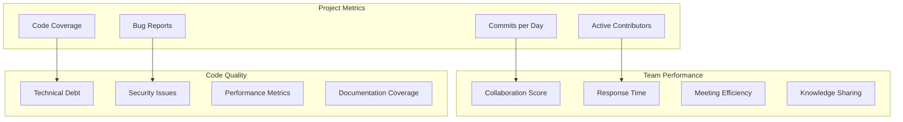
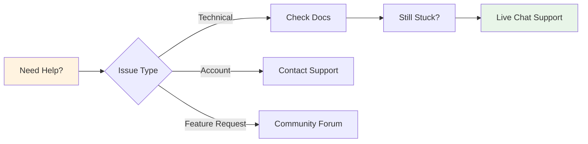

# 👥 Getting Started - User Guide

<div align="center">


**Your Journey to Collaborative Development Excellence**

</div>

---

## 🌟 Welcome to Mappa Collaborative IDE!

Transform your development workflow with the power of real-time collaboration, integrated video conferencing, and intelligent code assistance. This guide will help you get started and make the most of Mappa's powerful features.

## 🚀 Quick Start Journey

### 1️⃣ Create Your Account

```
    🌐 Visit mappa-ide.com
           │
           ▼
    📝 Click 'Sign Up'
           │
           ▼
    ✍️ Enter Details
    ├─ 📧 Email address
    ├─ 👤 Username  
    ├─ 🔒 Strong password
    └─ 🏷️ Full name
           │
           ▼
    📨 Verify Email
    (Check your inbox!)
           │
           ▼
    👤 Complete Profile
    ├─ 🖼️ Upload avatar
    ├─ ⚙️ Set preferences
    └─ 🎨 Choose theme
           │
           ▼
    🎉 Start Collaborating!
```

**Step-by-Step:**

1. **Visit** [mappa-ide.com](https://mappa-ide.com)
2. **Click** the "Get Started" button
3. **Fill in** your details:
   - Email address
   - Username (choose wisely - it's your identity!)
   - Strong password
   - Full name
4. **Verify** your email address
5. **Complete** your profile with avatar and preferences

### 2️⃣ Create Your First Repository

<div align="center">


</div>

```typescript
// Example: Creating a React TypeScript project
{
  name: "my-awesome-app",
  description: "Building the next big thing!",
  template: "react-typescript",
  visibility: "private",
  collaborators: ["teammate1", "teammate2"]
}
```

**Repository Templates Available:**
- 🌐 **React TypeScript** - Modern web applications
- 🚀 **Next.js** - Full-stack React framework
- 🐍 **Python FastAPI** - High-performance API development
- 📱 **React Native** - Cross-platform mobile development
- 🎨 **Vue.js** - Progressive web framework
- 📊 **Data Science** - Jupyter notebooks and ML tools

### 3️⃣ Invite Your Team

```bash
# Invite collaborators via email
invite-teammate@example.com → Role: Developer
project-manager@example.com → Role: Maintainer
designer@example.com → Role: Viewer
```

**Collaboration Roles:**

| Role | Permissions | Use Case |
|------|-------------|----------|
| **Owner** | Full control, billing, delete repo | Project owner |
| **Maintainer** | Manage settings, invite users, merge | Team lead |
| **Developer** | Read/write code, create branches | Developer |
| **Viewer** | Read-only access, comments | Stakeholder, client |

---

## 🎯 Core Features Walkthrough

### 💻 Real-time Code Editing

Experience seamless collaborative coding with conflict-free editing:

```
    👤 You                    🎯 Mappa IDE              👥 Teammate
        │                          │                         │
        │ Type: "function hello()" │                         │
        ├─────────────────────────▶│                         │
        │                          │ 📡 Broadcast Change    │
        │                          ├────────────────────────▶│
        │                          │                         │ Sees: "function hello()"
        │                          │                         │ Types: "{ return 'Hi!' }"
        │                          │◀────────────────────────┤
        │                          │ 📡 Broadcast Change    │
        │◀─────────────────────────┤                         │
        │ Sees: "{ return 'Hi!' }" │                         │
        │                          │                         │
        │ Both edit simultaneously │                         │
        │◀────────🔄 MERGED ─────▶│◀───────🔄 MERGED ──────▶│
        │                          │                         │
        │     ✨ No conflicts, ever! All changes preserved    │
        │                          │                         │

📊 Collaboration Features:
├─ 🎨 Live Cursors - See exactly where teammates are working
├─ 🔄 Instant Sync - Changes appear in real-time (< 50ms)
├─ 🛡️ Conflict Resolution - Y.js CRDT prevents overwrites
├─ 📍 Presence Indicators - Online status and activity
├─ 🎯 Smart Selections - Highlight active editing zones
└─ 📝 Operation History - Complete undo/redo support
```

### 📁 Smart File Management

Organize your project with intelligent file operations:

```
📁 my-awesome-app/
├── 📁 src/
│   ├── 📁 components/
│   │   ├── Button.tsx ✏️ (You)
│   │   └── Modal.tsx 👀 (Teammate)
│   ├── 📁 hooks/
│   └── App.tsx 🔄 (Syncing...)
├── 📁 public/
├── package.json
└── README.md 📝 (Recently updated)
```

**Smart Features:**
- 🔍 **Intelligent Search** - Find files, functions, and content instantly
- 🏷️ **Auto-tagging** - Automatic language detection and syntax highlighting
- 📚 **Version History** - Complete timeline of every change
- 🔄 **Git Integration** - Seamless version control workflow

### 🎥 Integrated Video Meetings

Collaborate face-to-face without leaving your code:

```
                    🎬 Start Meeting
                          │
                          ▼
                   ❓ Choose Meeting Type
            ┌─────────────┼─────────────┐
            │             │             │
            ▼             ▼             ▼
    ⚡ Quick Call   📅 Scheduled    🔍 Code Review
    (Instant)      (Calendar)      (Focused)
            │             │             │
            └─────────────┼─────────────┘
                          ▼
                  🖥️ Share Screen Options
                  ├─ 🖼️ Entire Screen
                  ├─ 🪟 Application Window  
                  ├─ 🗂️ Browser Tab
                  └─ 📝 Code Editor Only
                          │
                          ▼
                  📹 Record Session
                  ├─ 🎥 Video + Audio
                  ├─ 🖥️ Screen Recording
                  ├─ 💬 Chat Messages
                  └─ 📊 Code Changes
                          │
                          ▼
                  🤖 Automated Features
                  ├─ 📝 Meeting Notes
                  ├─ 📋 Action Items
                  ├─ 🔗 Code References
                  └─ 📊 Meeting Summary

📹 Meeting Features:
├─ 🎬 HD Video/Audio - Crystal clear communication (1080p)
├─ 🖥️ Screen Sharing - Share screen or specific applications
├─ 📹 Session Recording - Never miss important discussions
├─ 📝 AI Meeting Notes - Automated summaries and action items
├─ 🗓️ Calendar Sync - Google Calendar, Outlook integration
├─ 💬 In-meeting Chat - Text chat during video calls
├─ 🎯 Breakout Rooms - Split into smaller discussion groups
└─ 📊 Meeting Analytics - Track participation and engagement
```

### 💬 Contextual Communication

Stay connected with your team through multiple channels:

#### 📌 Code Comments
```typescript
function calculateTotal(items: Item[]) {
  // 💬 @johndoe: Should we add tax calculation here?
  // 💬 @janedoe: Good point! Let's create a separate tax service
  return items.reduce((sum, item) => sum + item.price, 0);
}
```

#### 🤖 AI-Powered Chatbot
```
You: "How do I implement authentication in React?"

🤖 Mappa Assistant: 
Here's a complete authentication flow:

1. Install dependencies: `npm install @auth0/auth0-react`
2. Configure Auth0 provider...
3. Create login/logout components...

[Generated code example]
Would you like me to create these files in your project?
```

---

## 🛠️ Advanced Workflows

### 🔄 Git Workflow Integration

Mappa seamlessly integrates with your Git workflow:

```
    📚 Git Repository Workflow
                
    🌿 main branch
    ├─ 🎯 Initial commit
    ├─ 🔀 Merge: feature/user-auth
    ├─ 🔀 Merge: feature/dashboard  
    └─ 🏷️ Release v1.0
    
    🌿 feature/user-auth
    ├─ 📝 Add login form
    └─ ⭐ Implement JWT auth (HIGHLIGHTED)
    
    🌿 feature/dashboard
    └─ 📊 Create dashboard

🔄 Branch Visualization:
┌─────────────────────────────────────────────────────────────┐
│  main     ●────●────────────●────────●────●                │
│           │    │            │        │    │                │
│  feature/ │    ●────●───────┘        │    │ (user-auth)    │
│  user-auth│         │                │    │                │
│           │         │                │    │                │
│  feature/ │         ●────────────────┘    │ (dashboard)    │
│  dashboard│                               │                │
│           │                               │                │
│  Time  ───┴───────────────────────────────┴─────────────▶  │
└─────────────────────────────────────────────────────────────┘

Git Integration Features:
├─ 🌿 Visual Branch Management - Interactive branch tree view
├─ 🔀 Smart Merge Conflicts - AI-assisted resolution with context
├─ 📋 Pull Request Reviews - Collaborative code review workflow
├─ 🏷️ Release Management - Tag, version, and deploy releases
├─ 📊 Commit Analytics - Track contribution patterns and velocity  
├─ 🔍 Blame Integration - Show who changed what and when
├─ 📈 Branch Comparison - Side-by-side diff visualization
└─ 🤖 Auto-commit - Smart commits based on code changes
```

### 🎨 Customizable Workspace

Make Mappa truly yours:

```json
{
  "theme": "dark-pro",
  "editor": {
    "fontSize": 14,
    "fontFamily": "JetBrains Mono",
    "tabSize": 2,
    "wordWrap": true,
    "minimap": true
  },
  "layout": {
    "sidebarPosition": "left",
    "panelPosition": "bottom",
    "editorGroups": "grid"
  },
  "features": {
    "aiAssistant": true,
    "liveShare": true,
    "autoSave": true,
    "formatOnSave": true
  }
}
```

**Customization Options:**
- 🎨 **Themes** - Light, dark, and custom themes
- ⌨️ **Keybindings** - VS Code, Vim, Emacs compatibility
- 🖥️ **Layout** - Flexible panel arrangements
- 🔧 **Extensions** - Rich ecosystem of community extensions

---

## 📊 Project Management Features

### 📈 Analytics Dashboard

Track your team's productivity and project health:



### 🎯 Goal Tracking

Set and track project milestones:

```typescript
interface ProjectGoal {
  id: string;
  title: "Implement User Authentication";
  description: "Complete OAuth integration with Google and GitHub";
  dueDate: "2024-02-15";
  progress: 75; // percentage
  assignees: ["johndoe", "janedoe"];
  tasks: [
    { name: "Setup OAuth providers", completed: true },
    { name: "Create login UI", completed: true },
    { name: "Implement logout", completed: false },
    { name: "Add session management", completed: false }
  ];
}
```

---

## 🎓 Learning & Development

### 📚 Built-in Tutorials

Interactive tutorials to master Mappa:

1. **🌟 Getting Started** (5 minutes)
   - Create your first repository
   - Invite a collaborator
   - Make your first collaborative edit

2. **⚡ Advanced Collaboration** (15 minutes)
   - Master real-time editing
   - Use voice/video integration
   - Manage merge conflicts

3. **🚀 Team Workflows** (20 minutes)
   - Set up Git workflows
   - Configure project templates
   - Implement CI/CD pipelines

### 🏆 Achievement System

Gamify your learning experience:

```
🏅 Achievements Unlocked:
┌─────────────────────────────────────┐
│ 🎯 First Collaboration (100 XP)    │
│ 🔥 Week-long Streak (200 XP)       │
│ 👥 Team Player (300 XP)            │
│ 🧙‍♂️ Code Wizard (500 XP)           │
└─────────────────────────────────────┘

Next: 🚀 Launch Master (1000 XP)
```

---

## 🔧 Tips & Best Practices

### ⚡ Productivity Hacks

1. **🔥 Keyboard Shortcuts**
   ```
   Ctrl/Cmd + K → Quick Command Palette
   Ctrl/Cmd + P → Quick File Search
   Ctrl/Cmd + Shift + P → Command Palette
   Ctrl/Cmd + ` → Toggle Terminal
   Ctrl/Cmd + / → Toggle Comment
   ```

2. **🎯 Smart Workflows**
   - Use branch prefixes: `feature/`, `bugfix/`, `hotfix/`
   - Implement conventional commits: `feat:`, `fix:`, `docs:`
   - Set up automated testing on commits
   - Use pull request templates

3. **👥 Team Collaboration**
   - Establish coding standards early
   - Use descriptive commit messages
   - Review code together in real-time
   - Schedule regular team sync meetings

### 🛡️ Security Best Practices

```yaml
# .mappa/security.yml
security:
  two_factor_auth: required
  session_timeout: 8_hours
  ip_whitelist: 
    - "192.168.1.0/24"
    - "10.0.0.0/8"
  
  permissions:
    sensitive_files:
      - ".env*"
      - "secrets/*"
      - "*.pem"
    
  code_scanning:
    enabled: true
    on_push: true
    auto_fix: false
```

---

## 🚨 Troubleshooting

### ❓ Common Issues & Solutions

#### 🔄 Sync Issues
**Problem**: Changes not appearing for teammates
**Solution**:
```bash
# Check connection status
Mappa → Settings → Connection Status

# Force refresh
Ctrl/Cmd + Shift + R

# Clear cache
Mappa → Settings → Clear Cache
```

#### 🎥 Video Call Problems
**Problem**: Poor video/audio quality
**Solution**:
- Check internet connection speed (min 1 Mbps)
- Close unnecessary browser tabs
- Update browser to latest version
- Allow camera/microphone permissions

#### 📁 File Upload Issues
**Problem**: Large files won't upload
**Solution**:
- File size limit: 100MB per file
- Use Git LFS for large files
- Compress images/videos before upload

### 🆘 Getting Help



**Support Channels:**
- 📚 **Documentation** - Comprehensive guides and API reference
- 💬 **Live Chat** - Instant help during business hours
- 📧 **Email Support** - support@mappa-ide.com
- 🎮 **Discord Community** - Connect with other developers
- 📹 **Video Tutorials** - Step-by-step visual guides

---

## 🎉 Welcome to the Community!

### 🌍 Join Our Global Community

Connect with thousands of developers worldwide:

- 🎮 **Discord Server** - Real-time chat and support
- 🐙 **GitHub Discussions** - Feature requests and feedback
- 🐦 **Twitter** - Latest updates and tips
- 📺 **YouTube** - Tutorials and live coding sessions
- 📝 **Blog** - Development insights and case studies

### 🤝 Contributing Back

Help make Mappa better for everyone:

1. **🐛 Report Bugs** - Help us identify and fix issues
2. **💡 Suggest Features** - Share your ideas for improvements
3. **📖 Improve Docs** - Help other users learn faster
4. **🎨 Create Templates** - Share project boilerplates
5. **🌟 Write Reviews** - Spread the word about Mappa

---

<div align="center">

**🎯 Ready to Transform Your Development Workflow?**

[Start Your Free Trial](https://mappa-ide.com/signup) | [Join Community](https://discord.gg/mappa-ide) | [Watch Demo](https://mappa-ide.com/demo)

---

**Next**: [Collaborative Editing](collaborative-editing.md) | **Previous**: [Documentation Home](../README.md)

</div>
